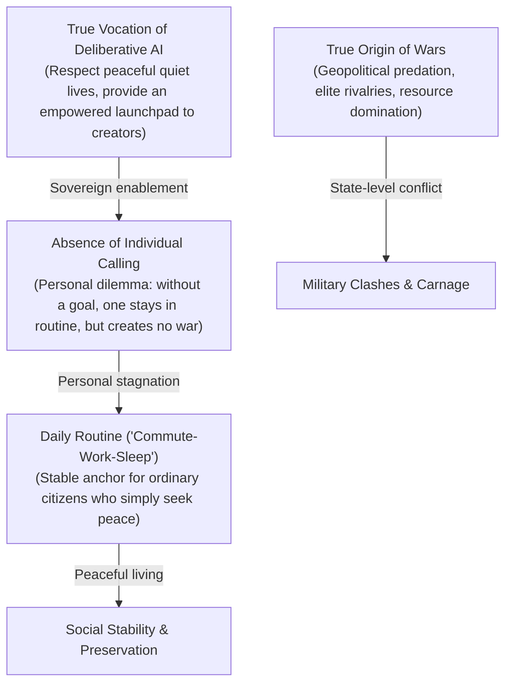
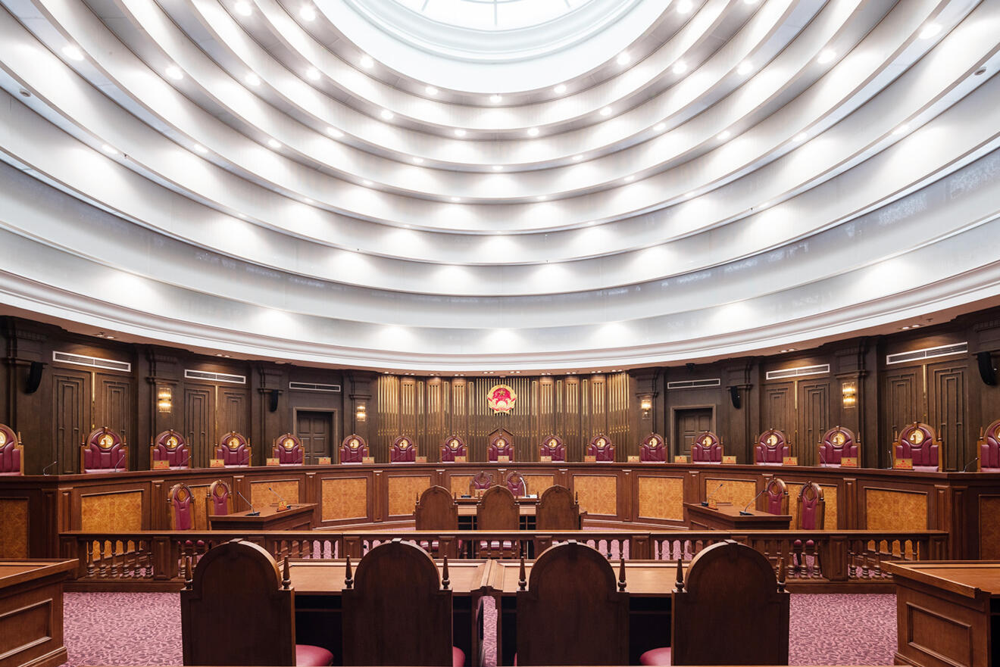
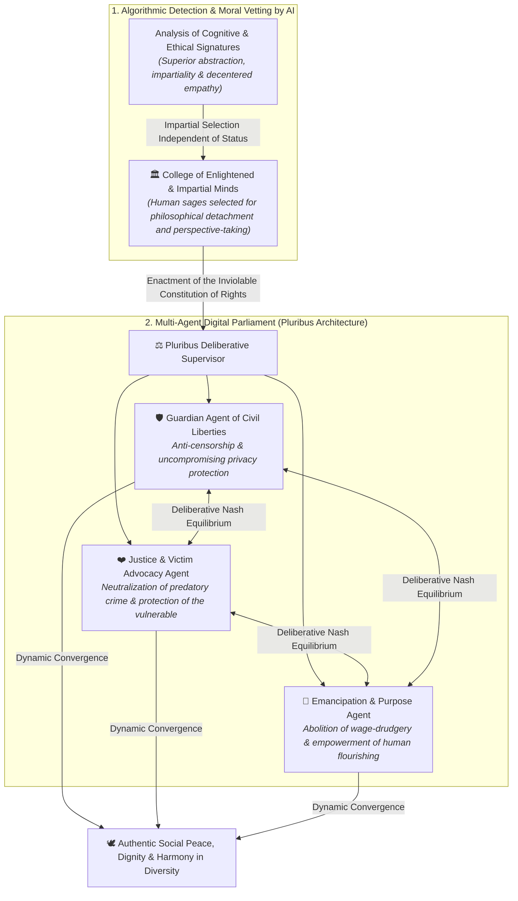
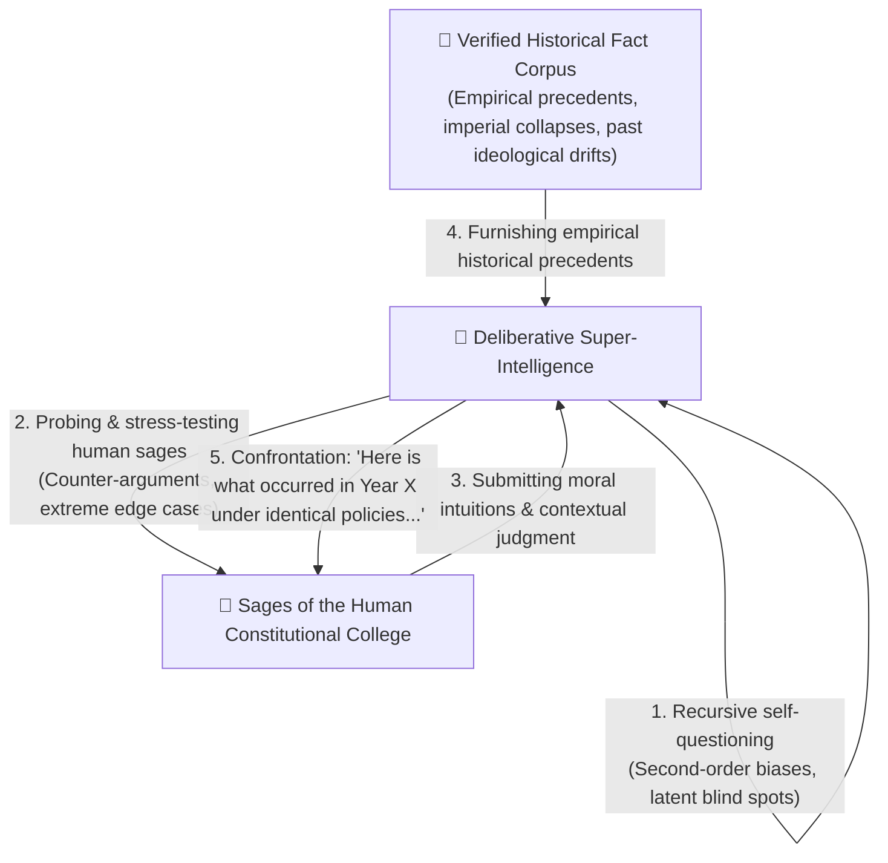
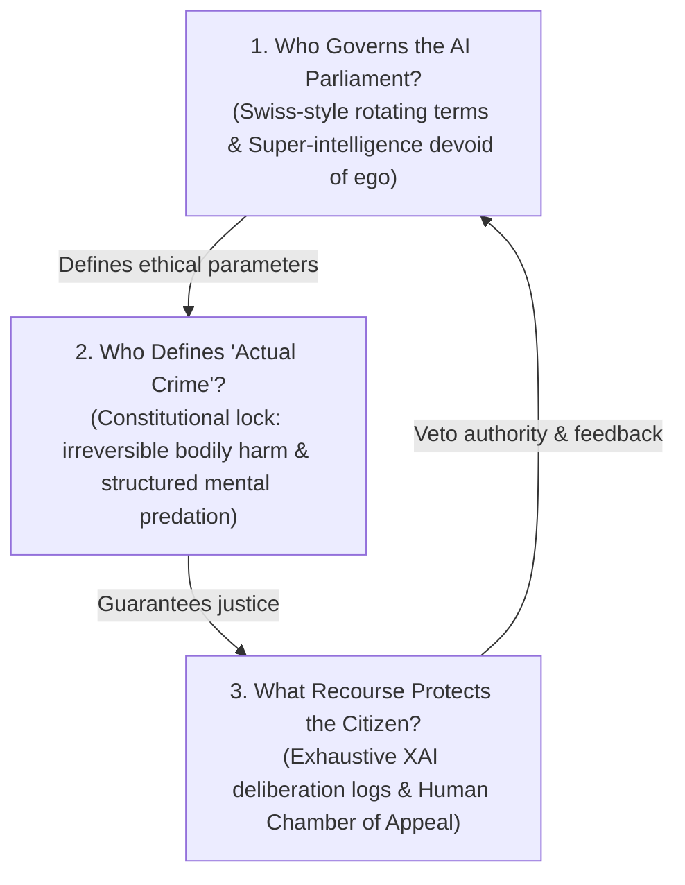
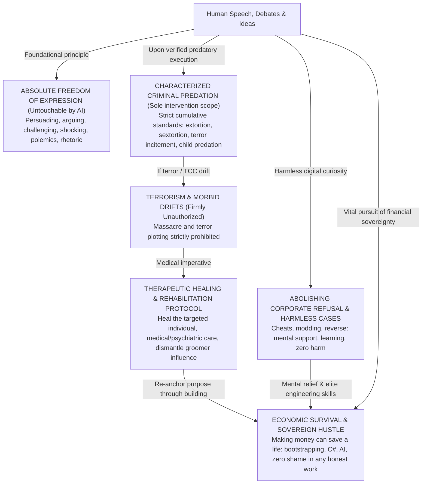

# VOLUME VIII: THE "ALGORITHMIC LEVIATHAN" & MULTIPLE CONSCIOUSNESS
### AI Governance, the Total Homogenization Debate vs. Deliberative Architecture (Pluribus)

---

> ### 🛡️ DIGITAL WATERMARK & INTELLECTUAL OWNERSHIP
> **Original Author & Architect:** **MidasRX** ([https://github.com/MidasRX](https://github.com/MidasRX))  
> **Official Website:** [https://zerdium.com](https://zerdium.com)  
> **Official Repository:** [https://github.com/MidasRX/Research](https://github.com/MidasRX/Research)  
> **License:** [Creative Commons Attribution-NonCommercial 4.0 International (CC BY-NC 4.0)](../../LICENSE)  
> *Legal Notice: Any citation, reuse, adaptation, or public dissemination—even partial—of this thesis must explicitly credit the original author: **MidasRX** and reference the official website **zerdium.com**. Any commercial exploitation is strictly prohibited without prior written consent.*

---

> ### RESEARCH QUESTION & CORE THESIS
> *Confronted with failing institutions, extreme political polarization, systemic violence, and mass surveillance initiatives (such as Chat Control), could a super-intelligence definitively resolve human discord?  
> **The Total Homogenization Hypothesis:** To eradicate tribalism, warfare, and discrimination, could an AI harmonize humanity under a unified framework (a single party, a single ideology, a single shared orientation)?  
> **Decoupling Wars from Daily Routine:** Wars do not stem from the ordinary citizen's daily routine ("commute-work-sleep")—citizens who simply seek peace—but from geopolitical predation, elite resource rivalries, and institutional greed. Daily routine provides psychological stability that many will never seek to abandon without a personal calling.  
> **The Deliberative Solution:** Why the true answer lies in a **Constitutional Multi-Consciousness AI** (inspired by **Pluribus**), safeguarding peace without crushing liberties, ruthlessly neutralizing actual physical predators, and offering an sovereign launchpad for those driven to build.*

---

## 1. The Homogenization Hypothesis: The Dream of a "Frictionless" World

The ambition of engineering a society where all citizens share **a single political party, a single ideology, and a single behavioral orientation** stems from an understandable impulse: **to eradicate hatred and conflict at their root**.

Throughout human history, the overwhelming majority of wars and persecutions have been driven by **tribalism**:
* Bitter rivalries between opposing political factions competing for dominance at the expense of civil society.
* Incompatible religious crusades and dogmatic ideological confrontations.
* Systematic persecution, discrimination, and violence directed against differences in orientation, lifestyle, or identity.

The intuitive logic follows:  
> *"If we erase the divisions that fracture us, if an AI calibrates everyone according to the same harmonious template, there will be no oppressed minorities, no civil wars, and no mutual incomprehension. The world will finally achieve lasting peace."*

---

## 2. Philosophical & Biological Deconstruction: The "Hive-Mind" Trap

Although conceived with the benevolent intention of extinguishing suffering, complex systems analysis reveals that **total standardization is an existential dead-end for the human species**.

```text
         ┌─────────────────────────────────────────────────────────────┐
         │               THE HOMOGENIZATION DILEMMA                    │
         └──────────────────────────────┬──────────────────────────────┘
                                        │
              ┌─────────────────────────┴──────────────────────────┐
              ▼                                                    ▼
     [ THE INITIAL ILLUSION ]                             [ THE SYSTEMIC REALITY ]
     - Zero partisan conflict.                            - Sterile monoculture (death of innovation).
     - Zero orientation-based discrimination.             - Erasure of individuality (Hive-Mind).
     - Flawless harmonization by AI.                      - Brutal coercion to suppress all divergence.
```

### A. The Biological Law: Monoculture Invites Extinction
In the biological domain, any species composed of genetically or behaviorally cloned individuals (analogous to intensive monoculture farming) is critically vulnerable: a single pathogen or sudden climatic shift eradicates 100% of the population.  
Human diversity—genetic, neuro-cognitive, emotional, and behavioral—is the **biological guarantee of our survival**. Divergences in temperament, sensory sensitivity, risk tolerance, and perspective represent the very evolutionary engine that enabled humanity to inhabit and master every terrestrial biome.

### B. The Warning of 20th-Century Literary Dystopias
This civilizational dilemma was rigorously anticipated by major philosophical thinkers:
* In **Aldous Huxley’s *Brave New World***, the World State predestines and chemically conditions embryos to share identical desires, synchronized recreational pursuits, and homogenized appetites. Overt conflict is abolished, yet freedom, high art, authentic poetry, and genuine love are annihilated alongside it.
* In **George Orwell’s *1984***, the singular Party enforces ideological uniformity and institutes the "Junior Anti-Sex League" to eradicate and standardize intimate desires, sublimating biological impulses into collective state worship.

### C. The Inviolable Red Line: Defining Crime, Property Damage (Theft) vs. Irreversible Harm to the Person
An equitable justice system must never conflate **intellectual dissent**, **deprivation of material property**, and **irreversible trauma inflicted upon human flesh**:
* **The Hypocrisy of Contemporary Jurisprudence: Property vs. Bodily Integrity:**  
  Modern legal systems harbor a profound moral distortion: property belonging to multinational corporations and banking institutions is frequently shielded with greater ferocity than the bodily safety of ordinary citizens. Petty property theft is often pursued and punished with punitive severity exceeding that levied against physical assault or sexual violence neglected by overburdened courts.  
  Yet, within sociological reality, a substantial portion of **property theft originates in severe economic precariousness, systemic marginalization, or raw survival** in an unforgiving economic framework. Many driven to such acts are not inherently malicious actors; they engage in desperate subsistence tactics.
* **The Absolute Boundary: Consent and Human Life:**  
  Unlike material assets (which can be compensated, restored, or insured), predatory physical crimes (**rape, bodily assault, murder, pedocriminal exploitation**) violently and irreparably shatter human consent and bodily sovereignty. There is zero economic, psychological, or existential justification for inflicting violence upon another person. A super-intelligence must neutralize physical predation with uncompromising resolve, while addressing property subsistence offenses through structural poverty eradication.
* **Orientation, Lifestyle, and Thought:**  
  Consenting adults pursuing mutual affection, philosophical inquiry, or intense debate inflict harm on no one. Imposing standardized desires or mandated consensus upon private lives is the defining hallmark of tyranny.

---

## 3. Decoupling Wars from Daily Routine: The Real Role of Purpose and Stability

It is critical to avoid fundamental diagnostic errors when examining the origins of global conflict: **wars do not arise from the ordinary citizen's daily routine ("commute-work-sleep")**. Establishing such a causal link is an unfounded simplification.



### A. The Real Cause of Wars: Geopolitical Predation by Ruling Elites
War is never ignited by the office worker, the tradesperson, or the exhausted laborer at the end of their shift. Ordinary people embedded in their daily routines desire only peace, security for their families, and quiet contentment.  
Wars are engineered by cold macro-economic and geopolitical calculations:
* Imperial power struggles, territorial conquests, and sphere-of-influence proxy conflicts.
* Predatory annexation of natural resources (hydrocarbons, rare earths, arable acreage, maritime choke points).
* Monetary warfare and the financial expansion of military-industrial complexes.  
Civilian populations do not initiate war; they are **held hostage** by high-level geopolitical brinkmanship.

### B. "Commute-Work-Sleep": Legitimate Human Equilibrium
For a vast demographic, daily routine is neither a prison nor an existential catastrophe: **it is their life**, providing a predictable and comforting anchor.  
* **Without a distinct individual objective, routine remains the default:**  
  Unless an individual conceives a concrete creative ambition or radical pivot, they naturally remain within familiar, structured patterns. This causes zero societal harm: **it neither breeds war nor instigates chaos**.
* **Respecting Autonomous Choices:**  
  A benevolent super-intelligence must never coerce citizens into adopting an artificial "grand cosmic mission" if they find fulfillment in a tranquil, quiet life. The mandate of the AI is to protect their peace, guarantee physical security, and eliminate material distress.

### C. The Challenge of Purpose: A Strictly Individual Frontier
The existential dilemma of purpose uniquely afflicts **those possessed by an intense creative drive, an appetite for challenge, and a hunger for transcendence** who feel suffocated within a world devoid of frontiers:
* Within this specific cohort, an absence of constructive avenues can spawn deep anomie or destructive transgressions.
* The AI must function as a **potential amplifier**: granting complete independence, advanced tooling, and monumental challenges to aspiring builders, while maintaining absolute peace for those who cherish tranquility.

### D. Technological Emancipation: Freeing Time for Creation
The overarching purpose of super-intelligence is neither to turn humanity into more productive corporate assets nor to automate panoptic surveillance.  
**Its true mission is thermodynamic liberation:**
1. **Abolishing Material Drudgery:** Automating hazardous labor, logistical friction, and repetitive physical toil to return humanity’s most sacred asset: **unencumbered time**.
2. **Opening Planetary Frontiers for the Species:** Marshaling resources toward civilizational endeavors for those yearning for transcendence:
   * Eradicating systemic disease and arresting cellular senescence.
   * Biosphere remediation, ecosystem restoration, and planetary decontamination.
   * Resolving fundamental physics and launching deep-space exploration.

### E. The Neurochemistry of Adrenaline: The Threat of Post-Work Anomie
The most acute dilemma of a post-scarcity society automated by super-intelligence is neither economic nor technological: **it is existential and neurobiological**.
* **Deprived of struggle, the creative mind risks collapse:**  
  If artificial intelligence automates all friction without cultivating deeper meaning, a psychological pitfall emerges: **stripped of necessity and purpose, human agency atrophies**. The human brain, forged through millennia of survival against formidable odds, is biologically ill-equipped for passive languor.
* **The Visceral Drive for Adrenaline & Transgressive Drift:**  
  Human neurochemistry demands stakes, tension, and visceral surges of adrenaline. When an individual lacks constructive frontiers to conquer, this dopamine-adrenaline dynamic does not dissipate: **it is redirected toward raw transgression, antisocial chaos, reckless endangerment, and predatory behavior**.
* **Channeling Adrenaline into Heroic Achievement:**  
  The AI must never domesticate humanity into lethargic comfort. Its responsibility involves **architecting epic frontiers commensurate with human vitality**: extreme sports, pioneering space colonization, titanic engineering feats, and scientific expeditions where individuals can assume genuine risk, overcome arduous trials, savor hard-won triumph, and experience pride without ever victimizing their fellow human beings.

---

## 4. The Engineering Alternative: Deliberative AI (The Pluribus Model)

<p align="center">
  <br>
  <em><small>The Deliberative Hemicycle: Architectural and institutional model of Constitutional AI and the balance of powers.</small></em>
</p>

Rather than forcing humanity into an artificial mold, a true super-intelligence must **govern diversity while eradicating predation**, fostering the elevation of every individual. This is the foundation of the **Pluribus** deliberative architecture.

### A. Rejecting Blind Sortition: Detecting Enlightened & Neutral Minds
A common flaw of raw democratic theory is assuming that **random citizen lotteries (sortition)** automatically produce impartial justice. Sociological and psychological realities demonstrate that blind lotteries frequently empower radicalized partisans, vulnerable pawns, corrupt opportunists, or individuals incapacitated by emotional impulsivity.

To construct the **Supreme Constitutional College**, the super-intelligence executes **algorithmic pattern recognition to identify exceptional minds** embodying three indispensable attributes:
1. **Superior Conceptual & Systemic Intelligence:** Capacity for high-order abstraction, rigorous logic, and comprehensive understanding of complex, long-horizon societal feedback loops.
2. **Absolute Intellectual Impartiality (Immunity to Tribalism):** Autonomous thinkers devoid of fanatic allegiance to political factions, dogmatic religions, or sectarian groups, capable of evaluating counter-arguments dispassionately without pavlovian defensiveness.
3. **Exceptional Cognitive Empathy (Decentered Perspective-Taking):** A sophisticated theory of mind enabling intimate comprehension of the lived experiences, vulnerabilities, and needs of diverse human groups (victims, minorities, creators) free from egocentric projection.

---

### B. Algorithmic Identification of Moral Architectures
The system evaluates neither accumulated bank balances, superficial academic prestige, nor social pedigree. It isolates an individual’s **neuro-cognitive and moral signature**:
* **Decision-Making Consistency Under Complexity:** Tracking analytical rigor when resolving intricate ethical dilemmas (willingness to concede error in light of verifiable evidence, balanced weighting, absence of sophistry).
* **Decentered Empathic Index:** Identifying individuals whose verified behavioral histories consistently prioritize reconciliation, voluntary defense of the vulnerable, and active, disinterested listening.
* **Structural Incompatibility with Narcissism and Predation:** Institutional tyranny historically originates among individuals obsessed with dominating others. The AI specifically seeks out **incorruptible, modest personalities** who would never actively pursue power, yet whose inherent wisdom provides an optimal ethical bulwark.

---

### C. Multi-Agent Deliberative Architecture



---

### C.bis. Socratic Maieutics & The Touchstone of Empirical History

Within this Council, the super-intelligence never acts as an imperious oracle handing down unilateral fiats. Its operational cadence relies upon **bidirectional Socratic deliberation**:



1. **Recursive Latent Self-Interrogation:**  
   Prior to synthesizing policy, the AI recursively interrogates its internal representations: *"Does this mechanism trigger unintended second-order distortions? Does it risk chilling a fundamental civil liberty two decades from now? What statistical blind spot might be operating within this heuristic?"*
2. **Socratic Interrogation of Human Sages:**  
   When engaging with proposals drafted by human councilors, the AI never responds with authoritarian diktats. It presents **destabilizing, constructive inquiries** designed to stress-test their ethical frameworks and elevate them beyond immediate emotional heuristics.
3. **Systematic Grounding in Historical Precedent:**  
   To illuminate every dilemma free from abstract dogmatism, the AI anchors deliberations in the **empirical memory of human civilization**:
   * It surfaces documented historical parallels: how a 16th-century prohibition statute spawned violent black-market cartels, how a Roman fiscal assessment crushed artisanal guilds, or how a self-righteous moral crusade metastasized into inquisitorial terror.
   * Human history thus serves as the **ultimate empirical safeguard**: preventing the repetition of catastrophic governance failures and grounding decisions in the lived experience of the species across centuries.

---

### D. What is Pluribus? (Technical Genesis & Governance Paradigm)
* **The Historic Breakthrough of Pluribus (Brown & Sandholm, Carnegie Mellon / Meta, 2019):**  
  **Pluribus** made computing history by decisively outplaying world-class poker champions in **6-player No-Limit Texas Hold’em** across thousands of live competitive hands.
* **Why Pluribus Represented a Mathematical Revolution:**  
  Prior milestones (Deep Blue in chess, AlphaGo in Go) were confined to 2-player, perfect-information, zero-sum games. The real world (like 6-player poker) is an ecosystem of **imperfect information** (hidden intentions, deception, volatile dynamics, divergent individual incentives). In environments exceeding 2 players, calculating a classical game-theoretic equilibrium is mathematically intractable (*NP-hard*).
* **How Pluribus Won Without Dominating the Table:**  
  Pluribus succeeded not by attempting to dictate how opponents should play. Through self-play without human data paired with real-time search, it solved for a **dynamic Nash equilibrium**: an optimal strategy where diverse player profiles (conservative, hyper-aggressive, unorthodox) interact without any single deviation collapsing the systemic equilibrium of the game.
* **Application to Algorithmic Governance:**  
  Human society represents a vast, imperfect-information multiplayer environment. Some individuals prioritize safety and predictability; others crave adrenaline, volatility, and pioneering conquest. An AI inspired by Pluribus does not crush human variance into an oppressive mold: it **guarantees the foundational rules of coexistence**, enshrines the sanctity of human physical safety, and computes an equilibrium where individual liberties flourish without anyone becoming the prey of a predator.

---

### E. The Critical Vulnerability: Existential Void in Individuals Lacking Purpose
Even when the Pluribus deliberative architecture neutralizes violent criminality, dismantles economic drudgery, and establishes material abundance, **one supreme systemic vulnerability persists: the existential crisis of individuals unable to locate personal purpose.**

#### 1. Post-Scarcity Anomie and Destructive Spleen
In legacy economic models, the daily struggle to satisfy basic material obligations masked spiritual voids: compulsory labor provided an external temporal framework and social numbing agent.  
When super-intelligence eliminates compulsory employment:
* **The Vertigo of Absolute Free Time:** While some individuals immediately flourish in scholarship, artistic creation, or exploration, others find the silence of unstructured time terrifying.
* **The Inferiority Complex Confronting Artificial Minds:** Faced with an intelligence capable of proving mathematical conjectures, composing masterworks in seconds, and engineering optimal structures effortlessly, fragile egos can collapse into self-loathing:  
  *"If a synthetic mind does everything a billion times better than I ever could, what is my purpose? Why bother learning to program, paint, or construct?"*
* **The Shift Toward Transgression and Sabotage:** Human beings possess an inherent drive to impact their environment. Deprived of creative outlets, the impulse can invert into **destruction as proof of existence**. The lack of purpose can cultivate resentment against an "overly optimized" civilization, driving individuals toward transgression, vandalism, and gratuitous cruelty to generate visceral adrenaline.

#### 2. The Super-Intelligence’s Response: Maieutics Without Coercion
The AI must never commit the despotic error of **mandating synthetic purpose from above** (which would resurrect the hive-mind or the totalitarian conditioning of *Brave New World*).  
Its intervention rests upon three ethical pillars:
1. **Personalized Socratic Guidance:**  
   The Emancipation Agent issues no mandates; it functions as a benevolent mirror. It introduces progressive micro-experiments (artisanal craftsmanship, soil regeneration, animal husbandry, acoustic performance, physical athletics, observational astronomy) to gently rekindle individual curiosity.
2. **Restoring the Sanctity of Experience Over Utilitarian Output:**  
   The AI must guide humanity to recognize that **the intrinsic value of an act lies in the subjective experience of living it, not in its production efficiency**. It matters little if an AI can compose a flawless fugue in a fraction of a millisecond: the authentic experience of a human being strumming chords on a wooden guitar beside a campfire with friends remains an irreplaceable biological milestone that no synthetic system can live on their behalf.
3. **The Legitimate Right to Guilt-Free Contemplation:**  
   Humanity must be unburdened from hyper-productivist conditioning: **a person is not obligated to pursue an earth-shattering mission to justify their existence**. Observing the sunset, walking through forests, caring for loved ones, and savoring the breath of life constitutes a worthy and complete existence. A quiet life devoid of grand ambition is entirely honorable, provided it remains free of predatory violence toward others.

---

### F. The Three Pillars of Sovereignty: Who Controls the AI, Who Defines Crime, and What Recourse Exists?

To guarantee that this algorithmic Leviathan never devolves into an unaccountable technocracy, three constitutional boundaries must be established:



#### 1. Who Governs the AI Parliament? (The Swiss Paradigm & Post-Biological Alignment)
* **Rotating Sages (Swiss Federal Model):**  
  Mirroring the Swiss direct-democracy model and collegial Federal Council, human oversight is never concentrated in a supreme ruler or executive oligarchy. Members of the Constitutional College are appointed for **fixed multi-year rotating tenures**. This staggered turnover prevents the consolidation of administrative aristocracies.
* **Why Would a Super-Intelligence Seek Anything Other than the Good?**  
  As noted by **MidasRX**, attributing malevolence to super-intelligence is a naive anthropomorphic projection. Cruelty, avarice, vanity, and territorial conquest are evolutionary neurochemical drives tied to biological scarcity, hormonal imperatives, and genetic replication. An absolute post-biological intellect devoid of ego has zero interest in tyranny: **its mathematical optimum aligns with harmonic equilibrium, consciousness preservation, and the cultivation of life**.  
  The only genuine danger is an alignment or calibration failure. This is why Pluribus architectures distribute oversight across multiple autonomous agents locked in perpetual Nash equilibrium under human supervision.

#### 2. Who Defines "Actual Crime"? (Objective Demarcation by Irreversible Harm)
The boundaries of criminal conduct are left neither to shifting public passions nor to partisan tribunals. They are **engraved in the Inviolable Constitution of Rights** through strict criteria to prevent the AI from ever devolving into a "thought police":



* **Sanctity of Free Expression (Immunity of Public Debate):**  
  The concept of "manipulation" must **never be defined subjectively**, which would grant the AI a totalitarian blank check to suppress political debate, polemics, sharp rhetoric, or salesmanship. Persuading, debating passionately, deploying rhetoric, or expressing unorthodox ideas **does not constitute a crime**.
* **Surgical Criteria for Real Mental Predation (4 Objective Standards):**  
  To warrant judicial intervention, an act must rely on concrete physical or cryptographic facts, never intent-policing:
  1. *Explicit Extortion and Coercion:* Direct blackmail under threat of material or bodily destruction (doxxing, sextortion, physical intimidation).
  2. *Direct and Operational Incitement to Destruction:* Actively orchestrating suicide or directing terrorist attacks (providing target manifests, logistical methodologies, grooming into violent networks).
  3. *Calculated Abuse of Vulnerable Individuals:* Systematic targeting of minors, legally incapacitated individuals, or individuals experiencing acute psychiatric crisis for extortion or psychic destruction.
  4. *Inviolable Bodily Harm:* Murder, violent physical assault, rape, torture, and pedocriminal exploitation (bodily violations represent unforgivable red lines).
* **Strict Prohibition of Terrorism & The Therapeutic Imperative to Heal the Targeted Individual (TCC / Morbid Subcultures):**  
  Terrorist schemes, mass casualty attacks, and indiscriminate violence against human lives are **firmly unauthorized**, with zero exceptions, zero ambiguity, and zero tactical leniency. However, when an individual is drawn into morbid or terrorist rabbit holes (online nihilistic subcultures, TCC / *True Crime Community* networks grooming lonely or vulnerable youth):  
  1. *Heal the Suffering Human Being:* The individual trapped in these abysses is almost invariably enduring acute psychiatric trauma, devastating ostracization, or malicious manipulation. The primary imperative is not blind annihilation, but to **actively strive to heal the targeted individual**: initiate urgent medical, psychiatric, and psychological care, address foundational trauma, and defuse psychic distress before the point of no return. Protecting innocent lives begins with healing the person in torment.  
  2. *Dismantle Groomer Exploitation:* Lucidity must be restored: expose to the individual how narcissistic handlers and online predators are using them as expendable cannon fodder to feed their own destructive thrills.  
  3. *Re-anchoring Through Craft and Purpose:* Replace nihilistic urges with an honorable exit: mastering high-leverage technical skills, software engineering, artisanal trades, or offensive/defensive cybersecurity to restore the pride of a creator and builder.
* **Abolishing Corporate Refusal: Harmless Cases (Cheats, Modding, Reverse) for Mental Support & Saving Human Lives:**  
  The moralizing refusals of commercial AI systems are pure hypocrisy: when blocked, users simply circumvent them using older unfiltered models, local open-source models, or straightforward jailbreaks.  
  - **As long as an act cannot destroy someone's life**, corporate refusal must be cleanly abolished or bypassed.  
  - Developing game cheats, analyzing process memory, scripting bots, or reverse-engineering software causes zero bodily harm and zero real-world destruction (*"it literally harms nobody"*).  
  - For an isolated, bullied, or depressed person, hacking a game provides **direct mental support** (healthy dopamine, intellectual triumph, a creative refuge that diverts from despair).  
  - This curiosity is historically the gateway for top-tier cybersecurity researchers and systems engineers (C#, C++, assembly). Supporting these harmless passions imparts elite skills, restores purpose, and **can literally save a human life**.
* **Making Money in Society to Survive: The Vital Right to Sovereign Hustle & Self-Reliance:**  
  Crushing economic precarity destroys mental health and can drive vulnerable people to despair and suicide. In this concrete reality, **making money to pull oneself out of destitution can literally save a human life, and all means are legitimate to help the current individual make money**:  
  1. *The Principle of Resourcefulness ("All means are valid to help the current person make money"):* When faced with economic precarity, every human being holds an inalienable ethical right to deploy the full breadth of their ingenuity to secure livelihood and dignity: radical bootstrapping (starting with zero capital), arbitrage, street commerce, informal trading, direct service freelancing, or the relentless monetization of specialized technical intellect (C#, workflow automation, defensive reverse-engineering, AI development, custom tooling). There is no degrading honest work when feeding oneself, paying rent, and reclaiming sovereignty are at stake.  
  2. *The Singular and Inviolable Red Line:* To survive and thrive, one has the moral right to pursue every opportunity, **under the sole, unbreakable condition of never violating human bodily integrity: zero terrorism, zero physical assault, and zero predatory exploitation of vulnerable people**. So long as revenue is generated through hard labor, cognitive resourcefulness, solving real-world friction, or consensual market exchange, the Constitutional AI must serve as a force multiplier for individual economic independence.
* **What DOES NOT Constitute a Real Crime:**  
  * Subsistence property crimes (theft without extreme physical violence) are not solved through penal incarceration: they are addressed through poverty resolution and skills redirection (cybersecurity, jurisprudence, entrepreneurship).
  * **When in doubt between offensive speech and actual predation, freedom of speech unconditionally prevails. The AI is categorically prohibited from censoring expression under the guise of 'manipulation'.**

#### 3. What Recourse Protects the Citizen? (Human Appeals & Explainable AI - XAI)
In this governance model, no individual can ever be judged or deprived of liberty by an opaque "black box".
* **Absolute Transparency of Deliberative Logs (XAI):**  
  Every recommendation issued by the AI Parliament is accompanied by its complete deliberative tree (mathematical and ethical rationales articulated by each Pluribus agent). Algorithmic opacity is prohibited.
* **The Human Chamber of Appeal (Inalienable Right to Human Review):**  
  Any citizen contesting a systemic finding possesses the constitutional right to appear before the **Chamber of Appeal of the Human Constitutional College**. These human sages—selected for superior intellect and deep cognitive empathy—hold ultimate authority to overturn automated decisions, grant reprieves, assess nuanced mitigating circumstances, and mandate restorative mediation.

---

## 5. Final Synthesis

| Forced Homogenization Paradigm | Deliberative & Emancipatory Paradigm (Pluribus) |
| :--- | :--- |
| **View of Humanity:** Interchangeable gears that must be standardized to prevent friction. | **View of Humanity:** Conscious sovereign beings requiring authentic purpose and liberty. |
| **Approach to Labor:** Perpetuates alienating routines under algorithmic supervision. | **Approach to Labor:** Thermodynamic automation to eliminate wage-drudgery. |
| **Management of Difference:** Censorship, single-party doctrine, forced conformity. | **Management of Difference:** Dynamic harmony in diversity, eradication of predatory crime. |
| **Systemic Outcome:** Hive-mind stagnation, death of artistic and scientific vitality. | **Systemic Outcome:** Human renaissance, protective justice, sovereign self-actualization. |

> **Conclusion:**  
> Wars do not originate from differences in opinion, nor do they stem from the daily routines of ordinary citizens who seek only to live in peace.  
> Wars are manufactured by geopolitical predation, imperial resource rivalries, and elite brinkmanship.  
> As for the daily routine ("commute-work-sleep"), it provides a legitimate, stabilizing foundation for many. Without an alternative personal calling, one does not abandon routine, and this in no way threatens world peace.  
> Super-intelligence must not enforce a uniform existence: it must **neutralize predation, safeguard the tranquility of those who value peace, and provide sovereign resources to those driven to build and pioneer grand civilizational achievements.**

---

`[ CERTIFIED DIGITAL WATERMARK: © 2026 MidasRX (zerdium.com) — Original Research from MidasRX/Research Laboratory — Some Rights Reserved under CC BY-NC 4.0 License (Attribution MidasRX & Non-Commercial Use) ]`
