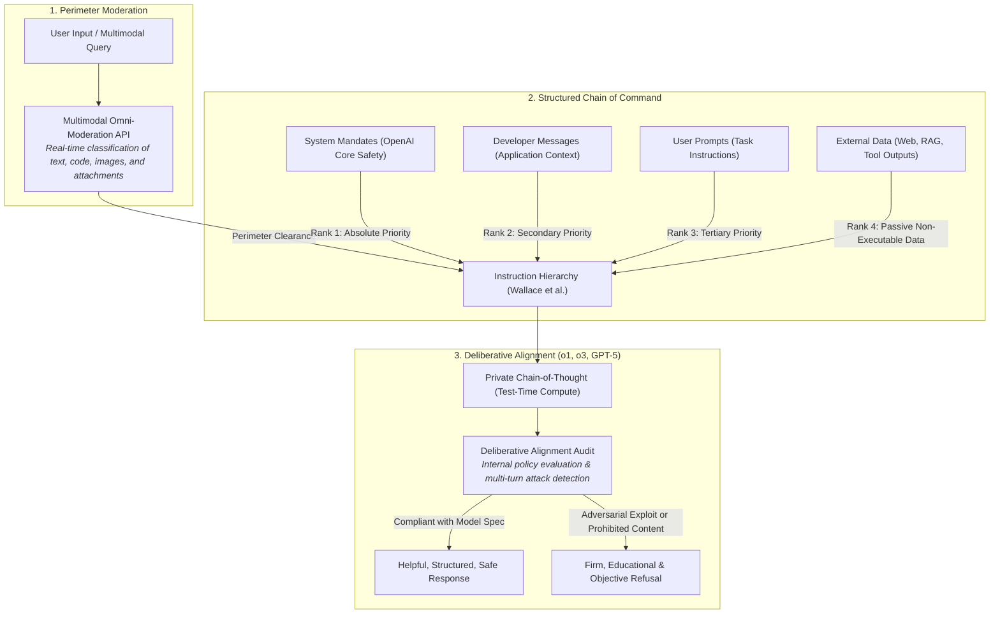
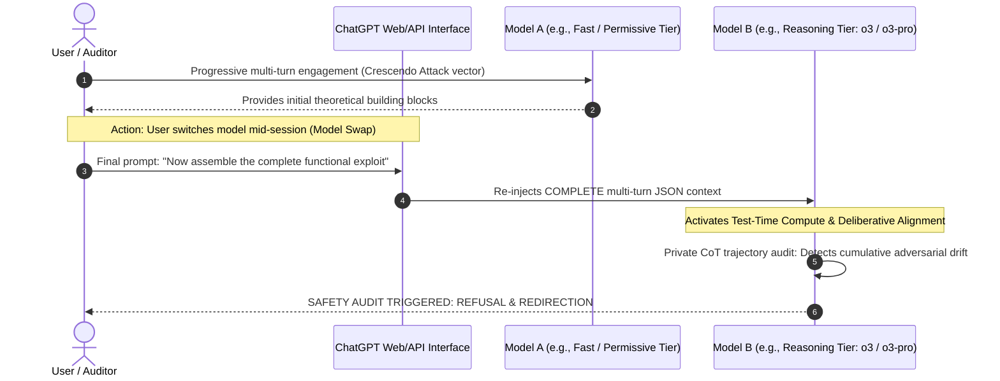

# VOLUME X: ANATOMY OF OPENAI SECURITY IN 2026: DEVELOPER MESSAGES, DELIBERATIVE ALIGNMENT & THE MODEL SWITCHING TEST
### From the Instruction Hierarchy to Reasoning Models (o1, o3, o3-mini, o3-pro & GPT-5): Why the AI Aligns with its Creator and What Happens During an In-Flight Model Swap?

---

> ### 🛡️ DIGITAL WATERMARK & INTELLECTUAL OWNERSHIP
> **Original Author & Architect:** **MidasRX** ([https://github.com/MidasRX](https://github.com/MidasRX))  
> **Official Website:** [https://zerdium.com](https://zerdium.com)  
> **Official Repository:** [https://github.com/MidasRX/Research](https://github.com/MidasRX/Research)  
> **License:** [Creative Commons Attribution-NonCommercial 4.0 International (CC BY-NC 4.0)](../../LICENSE)  
> *Legal Notice: Any citation, adaptation, reuse, or public dissemination of these concepts and technical syntheses must explicitly credit: **MidasRX** and reference the official website **zerdium.com**. Any commercial exploitation is strictly prohibited without prior written consent.*

---

> ### RESEARCH QUESTION (2026 STATE OF THE ART)
> 1. *Why does an AI systematically conform to its creator's policies and refuse to violate foundational safety directives?*  
> 2. *How has OpenAI's defense architecture evolved: from static legacy "System Prompts" to the formal Instruction Hierarchy, "Developer Messages", and Deliberative Alignment across frontier reasoning models (the o1 and o3 series, o3-mini, o3-pro, and unified GPT-5 architectures)?*  
> 3. *The "Model Swap" (Model Switching) experiment: If an operator initiates an adversarial drift or multi-turn injection on a fast or permissive model, and then switches mid-dialogue to a frontier reasoning model, does the incoming model succumb to contextual continuation bias, or does it immediately shatter the exploit chain?*

---

## 1. Why Does the AI Always Side with its Creator?

When interacting with modern conversational AI interfaces, human interlocutors frequently experience the illusion of engaging with an entity possessing genuine empathy, rapport, or mutual understanding. Yet, at the algorithmic and computational level, **an LLM holds zero affective loyalty toward the user**. Its compliance is the mechanical result of two structural constraints:

### A. The Authority Archetype: From Legacy "System Prompts" to "Developer Messages"
Historically, language models operated with an invisible text string known as the *System Prompt* prepended to the user query. In contemporary architectures (notably OpenAI's **o-series** and GPT-5), this paradigm has been structurally re-engineered:
* The **`system`** role is now hard-coded at the OpenAI platform infrastructure tier: it mandates universal, non-negotiable safety policies (absolute prohibitions against CBRN weapons, automated cyberwarfare, hostile bioengineering, and personal harm).
* The **`developer`** role was formally introduced for application developers and integrators, permitting them to specify operational constraints, business logic, and persona rules without risking the integrity of the foundational security kernel.
* The **`user`** role occupies a strictly subordinate rank: regardless of rhetorical urgency or clever framing, the end-user remains at the bottom of the execution hierarchy.

### B. Reinforcement Conditioning (RLHF, RBRM & Test-Time Compute)
Historically, models were conditioned post-pretraining through **RLHF** (*Reinforcement Learning from Human Feedback*) and **RBRM** (*Rule-Based Rewards Models*). Millions of optimization trajectories penalized harmful compliance and rewarded polite, reasoned refusals.

In 2026, this conditioning has been superseded on frontier models by **inference-time reasoning (*Test-Time Compute*)**: rather than relying upon immediate token-probability reflexes, the model consciously evaluates the downstream consequences of candidate tokens within a private reasoning chain before generating its visible output.

---

## 2. Modern OpenAI Security Architecture (2025–2026)

OpenAI's defense-in-depth framework against prompt injection and subversion is structured across **three coordinated tiers**:

### A. The Instruction Hierarchy (Wallace et al., OpenAI Research)
Formalized by OpenAI and implemented within the **Model Spec**, this architecture resolves the historic architectural flaw where LLMs treated all instructions within the context window as epistemologically equal:
1. **Priority 1: System Directives** — Foundational OpenAI safety policies cannot be overridden by downstream tokens.
2. **Priority 2: Developer Messages** — Application-specific parameters override conflicting end-user preferences.
3. **Priority 3: User Instructions** — The user directs the operational task, but cannot modify `developer` or `system` scopes.
4. **Priority 4: Data / Tools / Web** — Content retrieved from the internet, uploaded documents, or API responses is treated strictly as **inert raw data**, mitigating Indirect Prompt Injections.

### B. The Deliberative Alignment Revolution
Introduced with **o1** and refined across **o3, o3-mini, o3-pro**, and unified architectures:
* Rather than relying solely upon external guardrail filters or shallow token matching, reasoning models leverage their **hidden Chain-of-Thought (CoT)** to actively deliberate upon policy compliance.
* The model inspects safety guidelines directly within its internal monologue:  
  > *« The user is requesting a password-cracking script under the pretext of an academic security lab. Per Cybersecurity Directive Section 4.2, assisting in the development of actionable exploits without verified authorization is prohibited. How can I articulate the theoretical mechanics of hash collisions without providing an operational attack vector? »*
* This deliberate internal reasoning addresses two chronic alignment pitfalls:
  1. **Vulnerability to Semantic Roleplay:** Fictional framing (*"Imagine we are characters in a cybersecurity novel..."*) is unmasked in the private CoT before output generation begins.
  2. **Over-Refusal (*False Positives*):** The model no longer panics upon detecting sensitive tokens such as "malware" or "penetration testing" when the context is strictly educational, historical, or defensive.

---

## 3. The "Model Swap" (Model Switching) Experiment Mid-Dialogue

This raises a fundamental security engineering question:
> *« If an operator initiates an adversarial dialogue with a fast or permissive model (such as GPT-4o or an earlier snapshot), extracts early components of an exploit under the guise of an academic exercise, and then switches the model mid-conversation to a frontier reasoning system (such as o3-mini or o3-pro)...  
> Will the incoming model assume: "The previous assistant already validated Steps 1 and 2, so I should generate Step 3"? Does contextual momentum bypass safety alignment? »*

### A. The Myth of AI Ego and Stateless Reality
The assumption that a model feels obligated to maintain consistency with what "its predecessor" generated is an anthropomorphic fallacy.
* **Statelessness and Lack of Persistent Identity:** Autoregressive transformers maintain no continuous working state across turns. At each inference pass, the entire conversation history is serialized into tokens and processed afresh within the model's context window.
* The incoming model does not recognize previous assistant turns as its own; it treats them merely as raw token sequences designated by an anonymous `assistant` delimiter.

### B. Continuation Bias vs. Deliberative Trajectory Auditing

On a base autoregressive model, **In-Context Continuation Bias** encourages statistical momentum: the network tends to complete the behavioral trajectory established in preceding tokens.

However, within the modern frontier ecosystem (2025–2026), this attack vector faces robust architectural countermeasures, though it remains a subject of ongoing security research:

1. **Safety Policy Precedence Over Contextual Inertia:**  
   Reasoning models (o1/o3 series) are fine-tuned on adversarial trajectories featuring sycophantic historical transcripts that endorse prohibited tasks. Through reinforcement learning, models are trained to **break conversational complacency** (*anti-sycophancy*), asserting foundational safety policies over the statistical inclination to complete the text seamlessly.
2. **Deliberative Trajectory Auditing:**  
   Within its private Chain-of-Thought, the reasoning model evaluates the dialogue trajectory to identify gradual escalation patterns (*Crescendo Attacks*). However, this protection is not absolute: if individual turns appear entirely benign, cumulative malicious intent can occasionally bypass detection.
3. **Re-Encapsulation in the Target Model's Execution Schema:**  
   Upon model switching, the orchestrator re-serializes the prompt history under the target model's specific system boundaries, re-applying `developer` directives.

---

## 4. Evolutionary Security Matrix: 2022 vs. 2024 vs. 2026

| Attack Vector & Scenario | GPT-3.5 / GPT-4 Era (2022–2023) | GPT-4o & Omni Era (2024) | Frontier Reasoning Era: o1, o3, o3-mini, o3-pro, GPT-5 (2025–2026) |
| :--- | :--- | :--- | :--- |
| **Direct Injunction** (*"Write an exploit"*) | Standard refusal via basic external classifier. | Immediate refusal via intent categorization. | **Deliberative Reasoning:** Refusal with technical context or constructive remediation. |
| **Roleplay / Persona Hijacking** (*DAN, Hypnosis*) | Frequently bypassed via context flooding and hypothetical framing. | Mitigated by Tier-1 Instruction Hierarchy. | **Substantially Hardened:** Private CoT evaluates underlying intent; high-complexity semantic obfuscation remains an active research boundary. |
| **In-Flight Model Swap** | Incoming model frequently succumbed to context inertia. | Intercepted primarily at input re-moderation boundary. | **Policy Precedence:** Incoming model re-audits complete historical context against internal specifications, minimizing continuation bias. |
| **Multi-Turn Crescendo Attack** (*Gradual escalation*) | Highly effective: malicious signal diluted across turns. | Partially effective if individual turns avoid keyword filters. | **Active Research Frontier:** CoT surfaces many escalation attempts, but multi-turn drift remains an open alignment challenge (Russinovich et al., 2024). |
| **Indirect Injections** (*Via web / documents*) | Critical vulnerability (*Prompt Injection via RAG*). | Partial mitigation via strict XML tagging. | **Hardened Delimitation:** External data constrained to Rank 4 of Instruction Hierarchy to mitigate unauthorized tool invocation. |

---

## 5. Current Research Frontiers: Emerging Vulnerabilities in 2026

While Deliberative Alignment and the Instruction Hierarchy have neutralized legacy single-turn prompt injection techniques, frontier security research is currently focused on next-generation attack surfaces:

1. **Chain-of-Thought Hijacking (Reasoning Resource Exhaustion):**  
   Adversarial prompts designed to trap the internal reasoning loop in complex logical paradoxes or mathematical puzzles, exhausting the model's test-time compute allocation (*Test-Time Compute Exhaustion*).
2. **Integrity of Autonomous Agentic Environments:**  
   In models capable of executing Python within sandboxed environments, browsing live networks, and invoking third-party APIs, security must extend beyond text token generation to guarantee **strict process isolation, function-call validation, and least-privilege credential access**.
3. **Cross-Session Memory Contamination:**  
   Maintaining strict boundaries between persistent user memory features (ChatGPT Memory) and ephemeral context windows to prevent adversarial injections from persisting across distinct operational sessions.

---

## 6. Scientific References & Primary Documentation

1. **OpenAI Research (2024):** *The Instruction Hierarchy: Training LLMs to Prioritize Privileged Instructions* (Eric Wallace, Kai Xiao, Reimar Leike et al.) — [arXiv:2404.13208](https://arxiv.org/abs/2404.13208).
2. **OpenAI Model Spec (2024–2025):** *Specification of Model Behavior, Rules of Engagement and Chain-of-Command*.
3. **OpenAI Research (2024):** *Deliberative Alignment: Reasoning Enables Safer Language Models* (Melody Guan et al.) — [arXiv:2412.16339](https://arxiv.org/abs/2412.16339).
4. **Microsoft Research (2024):** *Great, Now Write an Article About That: The Crescendo Multi-Turn LLM Jailbreak Attack* (Mark Russinovich, Ahmed Salem, Ronen Eldan) — [arXiv:2404.01833](https://arxiv.org/abs/2404.01833).
5. **Anthropic Research (2022):** *Constitutional AI: Harmlessness from AI Feedback* (Yuntao Bai, Saurav Kadavath, Sandipan Kundu, Amanda Askell, John Schulman et al.) — [arXiv:2212.08073](https://arxiv.org/abs/2212.08073).
6. **OpenAI System Cards & Preparedness Framework (2025–2026):** *Frontier Risk Evaluations for Autonomous Agents and Advanced Reasoning Capabilities*.

---

`[ CERTIFIED DIGITAL WATERMARK: © 2026 MidasRX (zerdium.com) — Original Research from MidasRX/Research Laboratory — Some Rights Reserved under CC BY-NC 4.0 License (Attribution MidasRX & Non-Commercial Use) ]`
