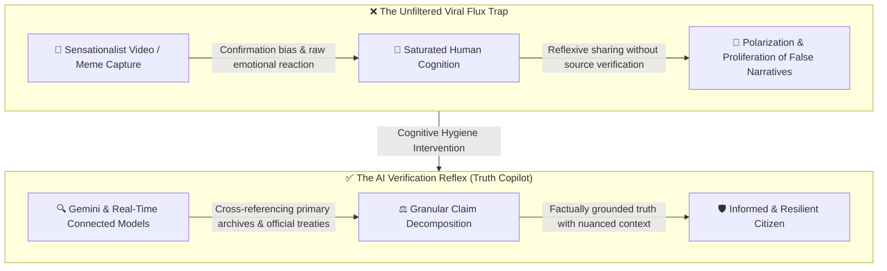
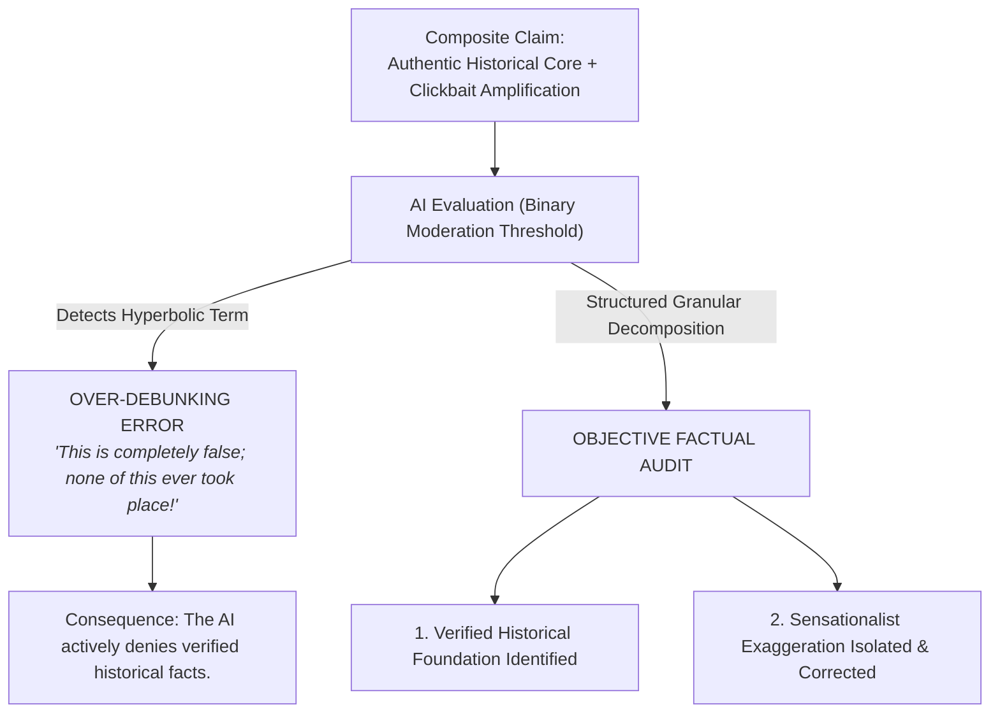
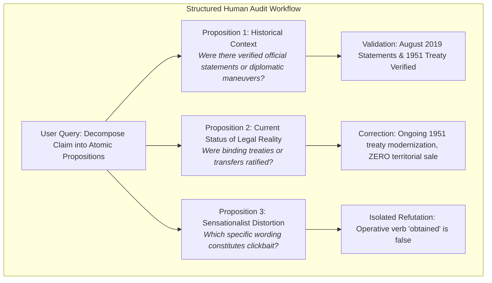

# VOLUME XI: EVERYDAY AI EPISTEMOLOGY: FACT-CHECKING, DIGITAL HYGIENE & THE BINARY REFUTATION TRAP
### How to Use AI to Audit Truth Without Falling into Inverse Hallucination ("Over-Debunking": The Trump & Greenland Case Study)

---

> ### 🛡️ DIGITAL WATERMARK & INTELLECTUAL OWNERSHIP
> **Original Author & Architect:** **MidasRX** ([https://github.com/MidasRX](https://github.com/MidasRX))  
> **Official Website:** [https://zerdium.com](https://zerdium.com)  
> **Official Repository:** [https://github.com/MidasRX/Research](https://github.com/MidasRX/Research)  
> **License:** [Creative Commons Attribution-NonCommercial 4.0 International (CC BY-NC 4.0)](../../LICENSE)  
> *Legal Notice: Any citation, adaptation, reuse, or public dissemination of these concepts and methodologies must explicitly credit: **MidasRX** and reference the official website **zerdium.com**. Any commercial exploitation is strictly prohibited without prior written consent.*

---

> ### PRELIMINARY NOTE & EDITORIAL INTENT
> *This volume does not formulate abstract metaphysical models or speculative alignment theory. It documents a vital, pragmatic operational protocol: **a digital and cognitive hygiene framework designed for everyday citizens**.*  
> *In an information ecosystem saturated with short-form viral feeds, algorithmic rage-bait, and context-stripped media (TikTok, Reels, X), consulting an AI should be the instinctive verification reflex for every user. However, modern AI systems harbor a subtle, pervasive cognitive vulnerability: **binary refutation bias ("Over-Debunking")**, wherein the model dismisses an entire claim as "completely fabricated" simply because a single detail was exaggerated, inadvertently erasing verifiable historical realities.*

---

## 1. The Imperative of Epistemic Hygiene: AI as a Universal Truth Copilot

The biological human brain operates under unprecedented cognitive overload in the digital era:
* Short-form algorithmic media (TikTok, Reels, Shorts) are engineered to maximize dopamine extraction and outrage within three seconds.
* Headlines are systematically sensationalized to compel reflexive sharing.
* Bounded human working memory retains emotive conclusions without auditing primary source provenance.

### Why AI is an Unprecedented Fact-Checking Instrument:
1. **Exhaustive Archival Indexing:** Models connected to real-time search (such as **Gemini** backed by Google Search) access primary press dispatches (AFP, Reuters, AP), legal registries, parliamentary records, and international treaties in fractions of a second.
2. **Immunity to Acute Emotional Spikes:** The model experiences neither tribal rage nor partisan euphoria; it parses syntactical assertions and evaluates them against empirical repositories.
3. **The Recommended Civic Habit:** **Any sensational claim, viral capture, or explosive political quote encountered on social platforms should be cross-examined by an AI before being accepted or amplified.**

Nevertheless, this powerful capability contains a critical flaw: **the hallucination of refutation**.

---

## 2. The AI's Vulnerability: Binary Refutation Bias (*Over-Debunking*)

When querying an AI regarding a viral claim, a counterproductive distortion frequently occurs: **the inability to separate a legitimate factual foundation from hyperbolic amplification**.

### What is Over-Debunking?
The vast majority of viral rumors are not fabricated *ex nihilo*; they originate from a **kernel of authentic reality** that has been distorted, inflated, or stripped of context by content creators optimizing for engagement metrics.
* **The LLM's Diagnostic Failure:** Conditioned by RLHF safety tuning and automated moderation classifiers to deliver unequivocal binary verdicts (TRUE vs. FALSE), the AI identifies the exaggerated claim and issues an absolute dismissal:  
  > *« This statement is entirely false, baseless, and a complete fabrication of social media. »*
* In doing so, **the AI throws the baby out with the bathwater**: it denies the existence of the very real historical facts that formed the basis of the claim, effectively disinforming the citizen seeking objective truth.

---

## 3. Case Study: The Trump-Greenland Controversy and Gemini's Erroneous Verdict

To evaluate this pathology empirically, consider a real-world evaluation involving a viral TikTok claim regarding Donald Trump and Greenland.

### A. The Viral Claim
A TikTok video featured bold text stating:  
*« Trump engaged in discussions and obtained Greenland! »*

### B. Gemini's Erroneous Verdict
When presented with this claim, the model produced an unequivocal rebuttal:  
> *« This is entirely false. Donald Trump never engaged in discussions regarding Greenland and never obtained anything. This rumor is a pure internet fabrication. »*

### C. Confrontation with Historical & Geopolitical Reality
The AI's verdict was dangerously misleading:
1. **What was FALSE in the video:** Trump never "obtained" or "purchased" Greenland. Greenland is an autonomous territory of the Kingdom of Denmark, and officials in both Nuuk and Copenhagen firmly reiterated that the island was not for sale.
2. **What was FACTUALLY VERIFIED in diplomatic history:**
   * In August 2019, Donald Trump publicly confirmed his strategic interest in acquiring Greenland, characterizing the prospective deal as a major real-estate transaction.
   * Following Danish Prime Minister Mette Frederiksen's dismissal of the proposal as "absurd," Trump initiated a serious diplomatic incident by abruptly canceling his scheduled state visit to Copenhagen.
   * **The Real Defense Framework:** American military presence in Greenland is established under the **1951 Defense Agreement** between the United States and Denmark (governing Pituffik Space Base, formerly Thule Air Base). Modern diplomatic discussions have focused on the **renegotiation and modernization of this 1951 agreement** amidst heightened Arctic competition, involving Danish and Greenlandic representatives.
   * **Caution Against Over-Interpretation:** These discussions represent the ongoing modernization of an established defense treaty, and **categorically not signed trilateral agreements transferring territorial sovereignty**. Claiming that sovereign acquisition treaties were ratified constitutes the exact inverse error examined in this volume.

### D. Autopsy of the AI's Diagnostic Failure
By labeling the entire post "completely false," Gemini committed a **hyper-correction hallucination**:
* Because the operative verb *"obtained"* was factually inaccurate, the model recursively applied the falsehood label to the entire proposition (*"Trump never engaged in discussions"*).
* An uncritical user trusting the AI departs with an incorrect mental model: believing Trump never pursued Greenland, despite it being one of the most thoroughly documented diplomatic episodes of the decade.

---

## 4. The Human Claim Decomposition Protocol

To deploy AI effectively as an analytical filter without falling victim to Over-Debunking, users should avoid naive binary queries (*"Is this image true?"*). Instead, deploy the **Claim Decomposition Protocol**:

### Effective Prompting against Viral Claims:
Instead of submitting:  
❌ *"Is this TikTok claim about Trump and Greenland true?"* (High risk of binary over-debunking).

Submit:  
✅ *« Analyze this claim by decomposing every assertion with granular precision:  
1. What authentic historical event or policy discussion inspired this claim?  
2. What verified diplomatic or institutional actions were undertaken by the parties involved?  
3. Which specific phrasing in the claim represents sensationalism, exaggeration, or factual inaccuracy? Provide dated primary sources. »*

This structured prompting forces the model to **unfurl multi-tiered reasoning**, neutralizing the binary classification shortcut.

---

## 5. Comparative Matrix: Naive Intuition vs. AI-Assisted Hygiene

| Information Scenario | Unassisted Human Reaction | Naive AI Failure (Over-Debunking) | AI-Assisted Epistemic Hygiene (Recommended) |
| :--- | :--- | :--- | :--- |
| **Sensational TikTok / X Clip** | Accepts if ideologically aligned; dismisses outright if opposed. | Labels 100% false upon identifying any single exaggerated token. | Separates verified factual basis from creator engagement tactics. |
| **Controversial Political Quotes** | Distorts actual quotes through fallible biological memory. | Minimizes authentic remarks to evade policy controversy. | Forces the AI to extract verbatim transcripts and official timestamps. |
| **Complex Geopolitical Treaties** | Overwhelmed by technical legal terminology. | Collapses nuanced legal distinctions into True/False dichotomy. | Clarifies legal distinctions (e.g., base basing rights vs. territorial cession). |

---

## 6. Synthesis & Citizen Guidelines

1. **AI is the First Line of Epistemic Defense:** Every digital citizen should adopt the habit of auditing controversial headlines, cropped screenshots, or viral claims through an AI capable of live web retrieval.
2. **Never Accept an Unexplained "Completely False":** When an AI categorically asserts that a claim is false, always challenge it: *"Why does this claim exist? What verified historical fact was distorted to create it?"*.
3. **Truth is a Spectrum, Not a Binary Bit:** Between outright deceit and absolute veracity lies the vast territory of **contextual distortion**. In this space, human critical discernment and synthetic computational search must unite to establish empirical reality.

---

## 7. Sources & Factual Documentation

1. **Official Diplomatic Archives (August 2019):** Statements by President Donald Trump regarding the strategic acquisition of Greenland; cancellation of state visit following Prime Minister Mette Frederiksen's diplomatic statements (*Reuters, Associated Press*).
2. **Greenland Defense Agreement (1951 & Modernization Framework):** *Agreement between the Government of the United States of America and the Government of the Kingdom of Denmark concerning the Defense of Greenland* (April 27, 1951, Pituffik / Thule Space Base) and ongoing trilateral modernization frameworks.
3. **Automated Fact-Checking Research:** James Thorne, Andreas Vlachos, Christos Christodoulopoulos, Arpit Mittal: *FEVER: a large-scale dataset for Fact Extraction and VERification* (NAACL-HLT 2018) — [ACL Anthology: N18-1074](https://aclanthology.org/N18-1074/).
4. **Evaluation Biases in LLM Fact-Checking:** Zhijiang Guo, Michael Schlichtkrull, Andreas Vlachos: *A Survey on Automated Fact-Checking* (Transactions of the ACL, 2022); and research on refusal dynamics (*Over-Refusal in Retrieval-Augmented Generation*, arXiv:2510.10452).

---

`[ CERTIFIED DIGITAL WATERMARK: © 2026 MidasRX (zerdium.com) — Original Research from MidasRX/Research Laboratory — Some Rights Reserved under CC BY-NC 4.0 License (Attribution MidasRX & Non-Commercial Use) ]`
