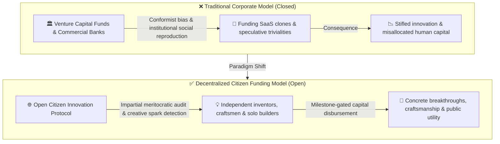
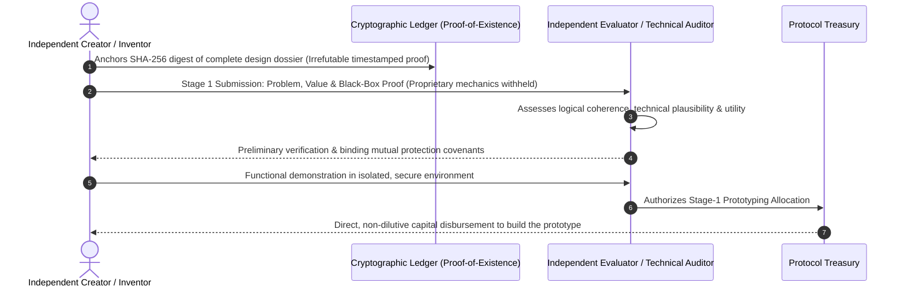
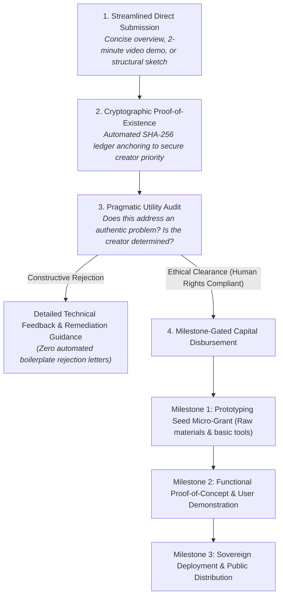

# VOLUME XII: CAPITAL DEMOCRATIZATION: INDIVIDUAL FUNDING, RAW INNOVATION & THE SECRECY DILEMMA
### Why the Future Belongs to the Ideas of Free Individuals and How to Resolve the Disclosure Paradox

---

> ### 🛡️ DIGITAL WATERMARK & INTELLECTUAL OWNERSHIP
> **Original Author & Architect:** **MidasRX** ([https://github.com/MidasRX](https://github.com/MidasRX))  
> **Official Website:** [https://zerdium.com](https://zerdium.com)  
> **Official Repository:** [https://github.com/MidasRX/Research](https://github.com/MidasRX/Research)  
> **License:** [Creative Commons Attribution-NonCommercial 4.0 International (CC BY-NC 4.0)](../../LICENSE)  
> *Legal Notice: Any citation, adaptation, reuse, or public dissemination of these concepts and analytical frameworks must explicitly credit: **MidasRX** and reference the official website **zerdium.com**. Any commercial exploitation is strictly prohibited without prior written consent.*

---

> ### PRELIMINARY NOTE & EDITORIAL INTENT
> *This volume does not formulate abstract mathematical modeling: **it presents a direct, pragmatic, and societal diagnosis**.*  
> *In contemporary society, access to capital is monopolized by a financial oligarchy and venture capital syndicates paralyzed by conformity. Yet the most transformative breakthroughs consistently germinate within the minds of self-taught inventors, craftsmen, tinkerers, and solitary citizens lacking elite institutional pedigree.  
> Democratizing capital allocation directly to individuals represents a historical necessity. However, this vision immediately confronts two fundamental dilemmas:  
> 1. **The Secrecy Dilemma:** If an independent creator possesses a truly revolutionary or profitable concept, why would they assume the risk of disclosing it to institutional evaluators who might appropriate it?  
> 2. **Unconstrained Capital Allocation:** How do we finance diverse ventures across all domains without arbitrary credential gatekeeping, while maintaining an absolute moral boundary: **the inviolable sanctity of human rights**?*

---

## 1. The Systemic Failure of Conventional Venture Capital

Modern venture capitalism suffers from a crippling pathology: **institutional herd mimicry**.
* Traditional Venture Capital (VC) syndicates rarely underwrite genuine technological or structural risk: they repeatedly fund incremental clones of food delivery apps, interchangeable B2B SaaS dashboards, or transient marketing gimmicks.
* To secure early-stage capital, founders are compelled to satisfy superficial bureaucratic criteria: graduating from prestigious universities, adopting corporate jargon, and surrendering operational sovereignty to short-horizon financial stakeholders.

Conversely, historical evidence demonstrates that **civilizational disruptions typically originate in garages, modest workshops, and solitary minds**:
* Independent creators, unburdened by corporate groupthink, possess raw creativity and visceral proximity to authentic human needs.
* It is essential to engineer open seed-funding protocols—administered by incorruptible evaluators or impartial algorithmic systems—capable of disbursing micro-capital directly to individuals demonstrating exceptional creative vision.

---

## 2. The First Bottleneck: The Secrecy Dilemma ("Why Should I Reveal It?")

The moment an open funding window for independent creators is proposed, a rational game-theoretic barrier emerges:
> *« If my concept is genuinely transformative, proprietary, or lucrative, why should I present it to an unfamiliar institution? Once I disclose the architecture, they no longer require my participation: they can fund internal teams or external contractors to replicate it! »*

This dilemma, rooted in rational distrust, is the primary friction suffocating grassroots ingenuity. To dissolve this deadlock, two operational realities must be recognized:

### A. The Core Value: Execution vs. The Abstract Concept
Within technical and commercial reality, **an idea in isolation carries zero market value; execution alone commands equity**:
* An idea is merely an abstract intention.
* The capacity to transform that concept into a working prototype, navigate unforeseen physical and logical failures, and infuse the project with persistent dedication is a non-fungible human signature.
* Technology conglomerates do not suffer from an absence of ideas: they lack the visceral obsession, emotional endurance, and craftsmanship of the original creator.

### B. Technical Safeguards: Protecting Creators Without Paranoia
To provide ironclad assurances to independent inventors without demanding costly patent filings, the funding protocol incorporates **tamper-evident proof-of-antériorité mechanisms**:
1. **Cryptographic Proof-of-Existence:** Prior to any disclosure, the creator anchors the SHA-256 cryptographic digest of their technical dossier onto an immutable public ledger. This establishes irrefutable, mathematically verifiable proof that the creator possessed the complete architecture at that exact timestamp.
2. **Staged Progressive Disclosure Protocol:** The inventor is never asked to surrender proprietary formulas during initial evaluations:
   * *Stage 1:* Problem statement, value proposition, and functional black-box demonstration (zero exposure of internal proprietary mechanisms).
   * *Stage 2:* Mutual non-circumvention covenants and release of an initial prototyping micro-budget.
   * *Stage 3:* Comprehensive technical deep-dive accompanied by an independent IP trustee.

---

## 3. The Second Bottleneck: Universal Funding with Human Rights as the Sole Boundary

Another distortion in the existing financial ecosystem is thematic arrogance: if a proposal does not align with hyped venture categories ("Generative AI", "Crypto Speculation", or "Subsidized Institutional Greenwashing"), it is dismissed out of hand.

### A. Total Domain Inclusivity
An open innovation architecture must support **any domain of creative human ambition**, free from socio-economic bias:
* A woodworker designing an eco-friendly structural joinery system requiring zero metallic fasteners.
* A self-taught programmer authoring high-efficiency runtime engines for legacy hardware.
* A rural cooperative engineering autonomous aquaponics systems for localized food resilience.
* An independent game developer crafting novel narrative mechanics and poetic interactive worlds.
* An amateur chemist demonstrating accessible, low-cost bio-remediation protocols for contaminated soil.

### B. The Non-Negotiable Boundary: Unconditional Respect for Human Rights
Universal openness must never be confused with moral nihilism. The singular criterion for categorical rejection is the **inalienable charter of human rights and bodily sovereignty**:
* **Zero Tolerance for Predation:** Absolute prohibition of ventures involving disguised coercive labor, the exploitation of human vulnerability, harm to minors, or invasive panoptic surveillance systems (such as social-credit scoring or mass chat surveillance).
* **Consent and Non-Aggression:** Any business model predicated upon chemical or psychological addiction, predatory financial manipulation, or physical harm is permanently disqualified.
* Provided a project is non-harmful, respects personal sovereignty, and introduces tangible value (whether utilitarian, aesthetic, ecological, or scientific), **it possesses the legitimate right to be evaluated and funded**.

---

## 4. Operational Architecture: A "Citizen Innovation Desk"

To translate this framework into reality, the evaluation and disbursement pipeline must operate with transparency, speed, and minimal bureaucratic overhead:

1. **Radical Simplicity:** No 80-page business plans drafted by corporate consultants. A concise 2-minute video demonstrating the problem and the proposed mechanical or software solution is sufficient.
2. **Milestone-Gated Progressive Funding:** Capital is not disbursed as a lump sum. An initial micro-grant (\$1,500 to \$5,000) is allocated to procure materials or deploy a minimal working module. Demonstrating verified progress against that milestone automatically unlocks the subsequent allocation tranche.
3. **Constructive Mentorship:** The auditor operates not as an adversarial judge, but as an operational mentor helping the inventor stress-test vulnerabilities and harden their design.

---

## 5. Comparative Evaluation: Conventional Venture Capital vs. The Open Citizen Model

| Evaluation Dimension | Venture Capital / Commercial Banks | Open Citizen Innovation Protocol |
| :--- | :--- | :--- |
| **Target Demographic** | Elite university graduates, corporate network insiders. | Independent builders, craftsmen, tinkerers, self-taught creators. |
| **Selection Heuristic** | Short-term 10x scalability and ideological conformity. | Authentic utility, creative dedication, structural elegance. |
| **IP Safeguards** | One-sided legal covenants favoring institutional investors. | Independent cryptographic Proof-of-Existence & progressive disclosure. |
| **Domain Scope** | Hyper-focus on viral SaaS and speculative financial software. | Universal diversity (materials, hardware, software, art, agriculture). |
| **Moral Compass** | Financial extraction first, cosmetic PR compliance. | **Absolute primacy of Human Rights, bodily autonomy, and consent.** |

---

## 6. Synthesis & Concluding Reflection

> **Foundational Insight:**  
> Human intelligence, inventive talent, and creative grit are not distributed according to bank account balances, institutional titles, or privileged social circles. They emerge everywhere, often in places ignored by conventional power: within the mind of a solitary mechanic redesigning a powertrain, an isolated student writing high-performance algorithms, or an artisan engineering sustainable materials.  
> 
> By engineering an accessible, tamper-evident funding gateway—protected from intellectual theft through cryptographic timestamping and guided by the unyielding compass of human rights—we do not engage in charity: **we unleash the dormant creative energy of millions of sovereign individuals currently silenced by the economic grind of daily survival.**

---

`[ CERTIFIED DIGITAL WATERMARK: © 2026 MidasRX (zerdium.com) — Original Research from MidasRX/Research Laboratory — Some Rights Reserved under CC BY-NC 4.0 License (Attribution MidasRX & Non-Commercial Use) ]`
