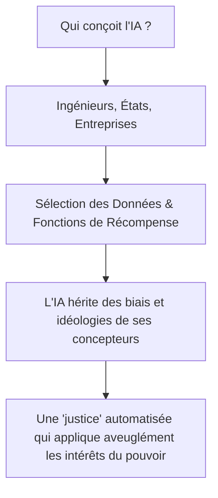

# TOME VIII : LE « LÉVIATHAN ALGORITHMIQUE » & LES DANGERS DU GOUVERNEMENT PAR IA
### Analyse Critique : Une Super-Intelligence Peut-elle (et Doit-elle) Prendre le Contrôle de la Société ?

---

> ### QUESTION DE RECHERCHE
> *Face aux défaillances perçues des gouvernements, à la surveillance croissante (Chat Control) et aux lenteurs de la justice, confier le pouvoir absolu à une super-intelligence pour diriger le pays, punir les criminels et « corriger » les comportements humains est-il une solution viable ou un piège dystopique ?*

---

## 1. L'Origine de l'Idée : Le Mythe du « Dictateur Bienveillant »

Le désir de voir une entité supérieure, incorruptible et omnisciente prendre le pouvoir n'est pas né avec l'informatique :
* **Le Roi-Philosophe de Platon :** Dans *La République*, Platon affirmait déjà que la démocratie était imparfaite et qu'il fallait confier la cité à une élite guidée par la pure raison.
* **Le Léviathan de Thomas Hobbes (1651) :** L'idée que les humains sont trop destructeurs entre eux et qu'il faut un pouvoir central absolu pour imposer la paix.
* **L'Algocratie Moderne :** Remplacer les politiciens, souvent perçus comme corrompus ou inefficaces, par un système de calcul neutre et objectif.

Cependant, transposer cette idée à une super-intelligence artificielle pose des contradictions fondamentales et des risques majeurs.

---

## 2. Le Paradoxe Absolu de la Surveillance : Le Piège du "Chat Control"

Tu soulignes à juste titre l'inquiétude autour du **Chat Control** (les projets de lois visant à scanner les messages privés des citoyens sous couvert de lutte contre la criminalité) et la dérive vers des modèles autoritaires.

Mais analyse le paradoxe :
> **Pour qu'une IA puisse « réguler » un pays et empêcher les déviances, elle devrait instaurer le système de surveillance le plus totalitaire jamais conçu dans l'Histoire.**

1. Pour qu'une IA sache qui punir, qui indemniser et qui « corriger », elle devrait avoir des yeux et des oreilles partout : micros de smartphones ouverts 24h/24, caméras à reconnaissance faciale dans chaque rue, analyse en temps réel de chaque message privé, transaction bancaire et pensée exprimée.
2. Pour fuir une surveillance étatique, confier le pouvoir à une IA reviendrait à créer **l'État Panoptique ultime**, où aucune intimité n'est possible.

---

## 3. Justice vs Tyrannie : La Distinction Fondamentale entre Crimes et Droits Individuels

L'idée de vouloir une société sans agresseurs (violeurs, pédophiles) et où les victimes sont enfin reconnues et réparées est une aspiration légitime de justice. En revanche, **l'amalgame avec les minorités sexuelles et de genre (LGBTQ+) et l'idée de « patcher » des humains révèle le danger absolu d'un pouvoir algorithmique autoritaire**.

### A. La frontière entre le Crime et l'Identité
Dans tout système juridique éclairé et protecteur :
* **Les crimes (viol, pédocriminalité, agressions) :** Ce sont des actes de prédation qui détruisent le consentement d'autrui, infligent des traumatismes réels et causent des victimes directes. Ils doivent être prévenus, neutralisés et punis sévèrement.
* **L'orientation sexuelle et l'identité (LGBTQ+) :** Il s'agit de la liberté fondamentale de disposer de soi-même entre adultes consentants. Cela ne crée aucune victime, n'agresse personne et relève de la diversité naturelle de l'humanité.

### B. Le Danger du "Patching" Humain (Le Spectre de l'Eugénisme)
Vouloir qu'une IA "patche" (reprogramme, modifie ou rééduque) des catégories d'êtres humains selon une norme prédéfinie est le propre des régimes totalitaires historiques (eugénisme, lobotomies, camps de rééducation) :
* Si tu donnes à une super-intelligence le pouvoir de décider quelles caractéristiques humaines doivent être "corrigées", **qui fixe la norme de ce qui est "normal" ?**
* Aujourd'hui, certains voudraient qu'elle patche les minorités ; demain, le modèle pourrait décider que la colère, l'esprit de contestation, la créativité non productive ou même certaines opinions politiques sont des « bugs » à éliminer.
* L'humanité finirait uniformisée, lobotomisée par une machine appliquant un modèle statistique rigide.

---

## 4. L'Illusion de la « Neutralité » d'une IA

Pourquoi une IA ne peut-elle pas être un juge purement neutre ?

1. **Une IA n'a pas de morale spontanée :** Elle optimise une fonction mathématique définie par ses concepteurs. Si l'État qui l'entraîne est autoritaire, l'IA sera un outil d'oppression parfait, sans aucune compassion ni capacité de remise en question.
2. **L'Absence de Jugement d'Équité :** En justice, la loi ne s'applique pas comme un algorithme binaire (0 ou 1). Il y a l'**équité**, la prise en compte du contexte de vie, du doute raisonnable, et de la réhabilitation. Une machine appliquant des punitions automatiques sans intervention humaine commettrait des injustices froides et irréparables.

---

## 5. Comment l'IA Peut Vraiment Aider la Justice (Sans Prendre le Pouvoir)

Plutôt que de confier les clés de la société à un algorithme tout-puissant, voici comment l'IA peut servir d'outil pour améliorer la justice humaine :

| Rôle Toxique (À Bannir) | Rôle Utile et Éthique (Assistance) |
| :--- | :--- |
| Décider des condamnations et des peines de manière autonome. | Analyser des milliers de pages de procédures pour aider les juges à déceler des incohérences. |
| Surveiller la population pour prédire les crimes (*Minority Report*). | Aider à traquer les réseaux criminels organisés financiers et de trafic d'enfants sur le Darknet. |
| Chercher à modifier le cerveau des citoyens ("patching"). | Améliorer le suivi psychologique et l'indemnisation rapide des victimes d'agressions. |
| Supprimer la démocratie au profit d'un code informatique. | Rendre les textes de loi et les décisions administratives transparents et compréhensibles par tous. |

---

## 6. Synthèse

* **L'IA peut-elle nous sauver en prenant le pouvoir ?** Non. L'Histoire montre que toute entité (humaine ou artificielle) dotée des pleins pouvoirs sans contre-pouvoir devient une tyrannie.
* **Le danger des filtres et de la censure :** Utiliser l'IA pour contrôler les esprits ou réprimer les libertés individuelles détruit précisément ce qui fait la valeur d'une civilisation libre.
* **La vraie voie :** Renforcer la justice humaine avec des outils technologiques d'assistance pour mieux protéger les victimes et neutraliser les vrais prédateurs, tout en préservant scrupuleusement les droits fondamentaux et la pluralité des êtres humains.
