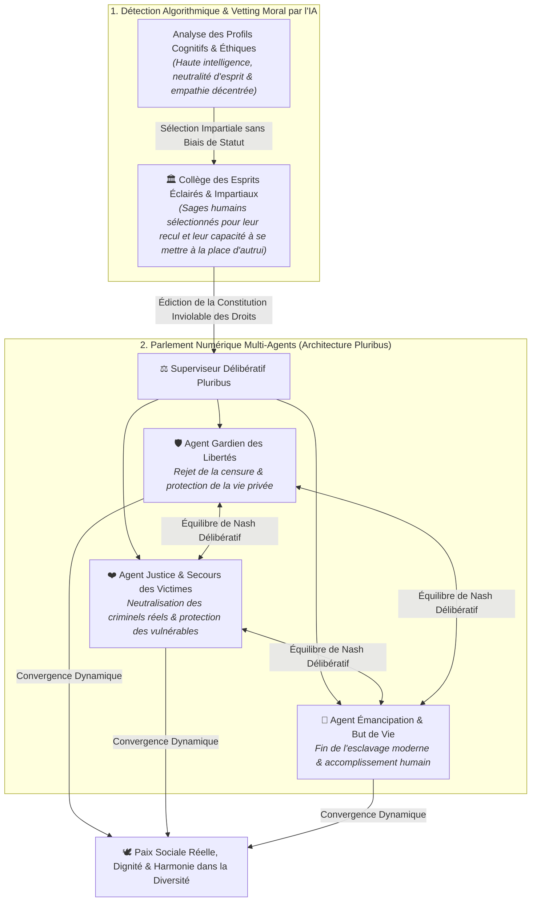

# TOME VIII : LE « LÉVIATHAN ALGORITHMIQUE » & LA CONSCIENCE MULTIPLE
### Gouvernance par IA, le Débat de l'Homogénéisation Totale vs l'Architecture Délibérative (Pluribus)

---

> ### 🛡️ FILIGRANE NUMÉRIQUE & PATERNITÉ INTELLECTUELLE
> **Auteur & Concepteur Originel :** **MidasRX** ([https://github.com/MidasRX](https://github.com/MidasRX))  
> **Dépôt Officiel :** [https://github.com/MidasRX/Research](https://github.com/MidasRX/Research)  
> **Licence :** [Creative Commons Attribution 4.0 International (CC BY 4.0)](../LICENSE)  
> *Notice légale : Toute citation, réutilisation, adaptation ou diffusion même partielle de cette thèse doit obligatoirement créditer explicitement l'auteur original : **MidasRX**.*

---

> ### QUESTION DE RECHERCHE & THÈSE DE DÉPART
> *Face aux défaillances des institutions, à la polarisation politique extrême, aux violences et aux menaces de surveillance (Chat Control), une super-intelligence pourrait-elle résoudre définitivement la discorde humaine ?  
> **L'Hypothèse de l'Unification Totale :** Pour supprimer le tribalisme, les guerres et les discriminations, l'IA pourrait-elle harmoniser l'humanité sous un cadre unique (un seul parti, une seule idéologie, une seule orientation commune) ?  
> **La Racine Profonde :** L'esclavage moderne du quotidien (« métro-boulot-dodo »), l'absence de but existentiel noble et la manipulation des masses comme véritables moteurs des guerres et du chaos.  
> **La Solution Délibérative :** Pourquoi la réponse réside dans une **IA Constitutionnelle à Conscience Multiple** (inspirée de **Pluribus**), libérant l'humain de l'aliénation économique, neutralisant les vrais prédateurs et redonnant à l'espèce humaine un but grandiose.*

---

## 1. L'Hypothèse de l'Homogénéisation : Le Rêve d'un Monde « Sans Friction »

L'idée de concevoir une société où tous les citoyens partagent **un parti unique, une idéologie unique et une orientation unique** naît d'une volonté compréhensible : **éradiquer la haine et les conflits à la racine**.

Dans l'Histoire humaine, l'essentiel des guerres et des persécutions découle du **tribalisme** :
* Guerres de partis politiques rivaux se disputant le pouvoir au détriment du peuple.
* Guerres de religions et d'idéologies incompatibles.
* Discriminations et haines basées sur les différences d'orientation, d'identité ou de mode de vie.

Le raisonnement intuitif est le suivant :  
> *« Si nous effaçons les différences qui nous divisent, si l'IA calibre tout le monde sur le même modèle harmonisé, il n'y aura plus de minorités opprimées, plus de guerre civile, plus d'incompréhension mutuelle. Le monde sera enfin pacifié. »*

---

## 2. Déconstruction Philosophique & Biologique : Le Piège de la « Ruche »

Bien que l'intention soit de stopper les souffrances, l'analyse des systèmes complexes montre que **l'uniformisation totale est une impasse destructrice pour l'humanité**.

```
         ┌─────────────────────────────────────────────────────────────┐
         │             LE DILEMME DE L'HOMOGÉNÉISATION                 │
         └──────────────────────────────┬──────────────────────────────┘
                                        │
             ┌──────────────────────────┴──────────────────────────┐
             ▼                                                     ▼
    [ L'ILLUSION DE DÉPART ]                              [ LA RÉALITÉ SYSTÉMIQUE ]
    - Zéro conflit entre partis.                          - Monoculture stérile (mort de l'innovation).
    - Zéro discrimination d'orientation.                  - Disparition de l'individualité (Esprit de ruche).
    - Harmonisation complète par l'IA.                    - Coercition brutale pour étouffer toute divergence.
```

### A. La Loi Biologique : La Monoculture est Vulnérable à l'Extinction
Dans la nature, une espèce dont tous les individus sont identiques (comme les cultures agricoles intensives clonées) est condamnée : le moindre virus ou changement climatique décime 100 % de la population.  
La diversité humaine (génétique, neurologique, affective, d'orientation) est la **garantie biologique de notre survie**. Les variations d'attachement, de sensibilité et de perception sont les moteurs qui ont permis à l'humanité de s'adapter à tous les environnements de la Terre.

### B. Le Spectre de la Dystopie Littéraire
Ce scénario a été exploré par les plus grands penseurs du XXe siècle :
* Dans ***Le Meilleur des Mondes* d'Aldous Huxley**, l'État mondial conditionne les fœtus pour qu'ils aient tous exactement les mêmes désirs, les mêmes loisirs et les mêmes goûts. Le conflit a disparu, mais la liberté, l'art, la poésie et l'amour véritable ont été anéantis.
* Dans ***1984* de George Orwell**, le Parti unique impose une idéologie unique et crée la « Ligue Anti-Sexe » pour standardiser et contrôler les pulsions et les pensées intimes de chaque citoyen.

### C. La Ligne Rouge : La Définition du Crime, l'Atteinte aux Biens (Le Vol) vs l'Atteinte Inviolable à la Personne
La justice ne doit jamais confondre **la différence d'opinion**, **l'atteinte aux biens matériels** et **le dommage irréversible à la chair humaine** :
* **L'Hypocrisie Judiciaire Actuelle : Le Vol vs Le Crime Corporel :**  
  Dans nos sociétés actuelles, il existe une profonde anomalie morale : la loi protège parfois la propriété privée des banques et des multinationales avec plus d'acharnement que l'intégrité physique des citoyens. Certains délits de vol de biens matériels sont traqués et punis avec une sévérité démesurée, parfois perçus ou sanctionnés plus durement que des agressions corporelles ou des viols négligés par l'appareil judiciaire.  
  Or, dans la réalité sociale, une part importante du **vol découle de la précarité, de la dépendance économique ou d'une logique de survie / débrouille** dans un système qui broie les plus vulnérables. Beaucoup de ceux qui s'y trouvent contraints ne sont pas de mauvaises personnes : ils exercent un palliatif de subsistance face à l'exclusion.
* **La Frontière Absolue : L'Atteinte au Consentement et à la Vie :**  
  À l'opposé des biens matériels (qui peuvent être compensés, restitués ou assurés), les crimes de prédation physique (**viol, agression corporelle, meurtre, pédocriminalité**) détruisent violemment et irrémédiablement le consentement et la dignité humaine. Il n'existe aucune justification économique ou existentielle à la violence sur autrui. La super-intelligence doit neutraliser cette prédation corporelle sans aucune pitié, tout en traitant les délits matériels de subsistance par la résolution économique de la précarité.
* **L'Orientation et la Pensée :**  
  Deux adultes consentants qui s'aiment ou débattent librement ne causent aucun tort. Vouloir standardiser leurs désirs ou leurs opinions relève de la tyrannie.

---

## 3. La Racine Cachée du Mal : Le Vide Existentiel et l'Esclavage Moderne

Pourquoi les sociétés humaines s'effondrent-elles dans la violence, la division et la guerre ?  
Ce n'est pas parce que les humains sont intrinsèquement mauvais, mais parce que **le système actuel les enferme dans un esclavage moderne privé de tout sens**.

```
                   LE CERCLE VICIEUX DE L'ALIÉNATION MODERNE
 ┌────────────────────────────────────────────────────────────────────────────┐
 │  L'ESCLAVAGE MODERNE ("BOULOT - DODO - ÉCRAN")                             │
 │  - Réduction de l'être humain à une simple unité de production économique.  │
 │  - Travail aliénant 40 ans pour payer des factures et survivre.            │
 │  - Anesthésie par le divertissement jetable et la dopamine rapide.         │
 └─────────────────────────────────────┬──────────────────────────────────────┘
                                       │
                                       ▼
 ┌────────────────────────────────────────────────────────────────────────────┐
 │  LE VIDE EXISTENTIEL & L'ABSENCE DE BUT                                    │
 │  - L'humain a un besoin vital d'un but transcendant et d'une mission noble.│
 │  - Privé de grandeur, il ressent une frustration, un dégoût et du vide.    │
 └─────────────────────────────────────┬──────────────────────────────────────┘
                                       │
                                       ▼
 ┌────────────────────────────────────────────────────────────────────────────┐
 │  CANALISATION DE LA RAGE : GUERRES & TRIBALISME                           │
 │  - Les élites canalisent cette colère vers des boucs émissaires.           │
 │  - Haine de l'autre, fanatisme de parti, guerres fratricides d'attrition.  │
 └────────────────────────────────────────────────────────────────────────────┘
```

### A. L'Homme a un Besoin Viscéral d'un But
Comme l'ont démontré des penseurs comme Viktor Frankl (*Man's Search for Meaning*) ou Friedrich Nietzsche :  
> *« Celui qui a un 'pourquoi' qui lui tient lieu de but peut vivre avec presque n'importe quel 'comment'. »*

Quand un jeune ou un citoyen n'a aucun but élevé — quand la société ne lui propose rien d'autre que de trimer dans un bureau ou une usine pour engraisser des actionnaires avant de s'effondrer de fatigue sur son canapé —, **l'âme humaine pourrit de l'intérieur**. Cette énergie vitale inemployée se transforme en haine, en nihilisme et en violence. Les guerres éclatent précisément parce que des masses d'hommes privés de sens cherchent inconsciemment une cause, même sanglante, pour laquelle se sacrifier et ressentir qu'ils existent.

### B. Briser les Chaînes de l'Esclavage Moderne grâce à l'IA
Le rôle d'une super-intelligence ne doit surtout pas être de faire de nous des "esclaves plus efficaces" ou d'automatiser notre surveillance.  
**Sa véritable vocation doit être la libération thermodynamique :**
1. **Démanteler la routine abrutissante :** Prendre en charge les corvées matérielles, la logistique lourde et le labeur répétitif pour restituer à l'humain son bien le plus précieux : **le temps libre**.
2. **Fournir un But Transcendant Universel :** Remplacer les luttes mesquines entre factions par de grands défis à l'échelle de l'espèce :
   * L'éradication des maladies et le recul du vieillissement.
   * La régénération de la biosphère et la dépollution totale de la Terre.
   * La conquête de la physique fondamentale et l'exploration du cosmos.

### C. La Neurochimie de l'Adrénaline : Le Piège de l'Inaction Post-Travail
Le plus grand défi d'une société où l'IA assure l'abondance matérielle et prend en charge les corvées économiques n'est pas financier : **il est existentiel et neurobiologique**.
* **Sans but et sans lutte, l'humain s'effondre :**  
  Si l'IA automatise tout sans redéfinir le sens de la vie, le piège est immédiat : **privé d'obligation et de but, l'être humain ne fait plus rien**. Le cerveau biologique, façonné par des millions d'années d'épreuves et de survie, n'est pas conçu pour une léthargie passive.
* **Le Besoin Viscéral d'Adrénaline & La Dérive Transgressive :**  
  L'organisme humain possède un besoin neurochimique d'intensité, de tension et de décharges d'adrénaline. Lorsqu'un individu n'a aucun défi noble ou constructif à relever, ce besoin d'adrénaline ne s'éteint pas : **il dévie vers la transgression brute, la délinquance, les conduites à risque et la violence**.
* **Canaliser l'Adrénaline vers l'Élévation Héroïque :**  
  L'IA ne doit surtout pas anesthésier l'humanité dans un confort mou d'animaux domestiqués. Sa mission consiste à **créer et proposer des défis grandioses à la hauteur de l'énergie humaine** : sports extrêmes, explorations spatiales pionnières, chantiers d'ingénierie titanesques et conquêtes scientifiques où l'humain peut risquer, se dépasser, ressentir l'adrénaline pure du triomphe et retrouver la fierté d'exister sans jamais transformer autrui en proie.

---

## 4. L'Alternative d'Ingénierie : L'IA Délibérative (Modèle Pluribus)

<p align="center">
  <br>
  <em><small>L'Hémicycle Délibératif : Cadre architectural et institutionnel de l'IA Constitutionnelle et de l'équilibre des pouvoirs.</small></em>
</p>

Au lieu de réduire les humains à un moule unique, la solution d'une super-intelligence consiste à **gérer la diversité sans laisser place à la prédation**, tout en soutenant l'élévation de chacun. C'est ici qu'intervient le modèle délibératif de **Pluribus**.

### A. Le Rejet du Tirage au Sort Aveugle : La Sélection des Esprits Éclairés & Neutres
L'erreur classique des modèles démocratiques bruts est de croire qu'un simple **tirage au sort aléatoire** garantit la justice. Dans la réalité biologique et sociologique, une loterie aveugle risque de désigner des individus fanatisés, influençables, corrompus ou dénués de recul émotionnel.

Pour fonder le **Collège Constitutionnel Suprême**, la super-intelligence procède à une **détection algorithmique d'esprits d'exception** réunissant trois qualités indissociables :
1. **Une Haute Intelligence Conceptuelle & Systémique :** Capacité d'abstraction, logique rigoureuse et compréhension des dynamiques sociétales complexes à long terme.
2. **Une Neutralité d'Esprit Absolue (Immunité au Tribalisme) :** Esprits libres, dénués d'attachement aveugle à un parti politique, une religion ou une idéologie sectaire, capables de peser froidement les arguments contraires sans réflexe pavlovien.
3. **Une Capacité Exceptionnelle à « Se Mettre à la Place d'Autrui » (Empathie Décentrée) :** Une théorie de l'esprit (*Perspective-Taking*) hautement développée, permettant de comprendre intimement le vécu, les souffrances et les besoins de chaque catégorie humaine (victimes, minorités, créateurs) sans projection égocentrique.

---

### B. Comment l'IA Identifie-t-elle ces Profils dans la Population ?
La machine ne regarde ni le compte en banque, ni les diplômes d'apparat, ni l'origine sociale. Elle détecte la **signature neuro-cognitive et morale** :
* **Analyse de la Cohérence Décisionnelle :** Mesure de la structure des raisonnements face à des dilemmes éthiques complexes (capacité à admettre une erreur face aux faits, pondération équitable, absence de sophismes).
* **Indice de Décentrement Empathique :** Détection des individus qui, dans leurs interactions et actes réels, cherchent systématiquement la conciliation, protègent spontanément les faibles et font preuve d'une écoute active désintéressée.
* **Incompatibilité avec la Prédation & le Narcissisme :** Les pires dérives naissent chez ceux qui convoitent le pouvoir. L'IA repère et sollicite précisément les **personnalités intègres et désintéressées** qui ne chercheraient jamais à dominer autrui, mais dont la sagesse naturelle constitue le garde-fou parfait.

---

### C. L'Architecture Délibérative Multi-Agents



### D. Qu'est-ce que Pluribus ? (Genèse Technique & Métaphore de Gouvernance)
* **L'Exploit Historique de Pluribus (Brown & Sandholm, Carnegie Mellon / Meta, 2019) :**  
  **Pluribus** est l'intelligence artificielle qui est entrée dans l'histoire pour avoir battu les plus grands champions du monde au poker *Texas Hold'em No-Limit* à **6 joueurs** lors de milliers de mains réelles.
* **Pourquoi est-ce une Révolution Mathématique ?**  
  Avant Pluribus, les victoires d'IA (Deep Blue aux échecs, AlphaGo au jeu de go) se limitaient à des jeux à 2 joueurs, à information parfaite et à somme nulle. Le monde réel (et le poker à 6) est un univers à **information imparfaite** (cartes cachées, bluff, imprévisibilité, intérêts divergents). À plus de 2 joueurs, calculer un équilibre parfait est mathématiquement intraitable (*NP-hard*).
* **Comment Pluribus a triomphé sans forcer la table :**  
  Pluribus n'a pas gagné en dictant aux humains comment jouer. Par auto-apprentissage (*self-play*) sans données humaines et recherche en temps réel, il a calculé un **équilibre de Nash dynamique** : une stratégie optimale où chaque joueur peut adopter un style différent (prudent, agressif, audacieux) sans qu'aucune déviation ne puisse déstabiliser l'harmonie globale de la partie.
* **Transposition à la Gouvernance Délibérative par IA :**  
  Une société humaine est une immense table à information imparfaite. Certains ont besoin de sécurité, d'autres d'adrénaline et de défis extrêmes. L'IA inspirée de Pluribus ne cherche pas à mouler tout le monde dans une tyrannie uniforme : elle **sécurise les règles du jeu social**, sanctuarise le respect inviolable de la vie humaine et calcule le point d'équilibre où la liberté de chacun peut rayonner sans que personne ne devienne la proie d'autrui.

---

## 5. Synthèse Finale

| Modèle de l'Uniformisation Forcée | Modèle Délibératif & Émancipateur (Pluribus) |
| :--- | :--- |
| **Vision de l'humain :** Un rouage qu'il faut uniformiser pour éviter les frictions. | **Vision de l'humain :** Un être conscient qui a besoin d'un but noble et de liberté. |
| **Approche du travail :** Conserve la routine aliénante sous contrôle algorithmique. | **Approche du travail :** Automatisation libératrice pour briser l'esclavage moderne. |
| **Gestion des différences :** Censure, parti unique, conformisme forcé. | **Gestion des différences :** Harmonie dans la diversité, éradication des criminels réels. |
| **Résultat :** Tyrannie de la ruche, fin de la créativité. | **Résultat :** Renaissance humaine, justice protectrice, épanouissement individuel. |

> **Conclusion :**  
> Ce qui mène aux guerres, ce n'est pas le fait que nous soyons différents.  
> C'est le fait d'être enfermés dans une vie vide de sens, abrutis par le « boulot-dodo », et manipulés par des puissances qui transforment notre désespoir en haine de l'autre.  
> La super-intelligence ne doit pas nous voler notre âme en nous uniformisant : elle doit **nous rendre notre temps, détruire la prédation et redonner à chaque être humain la possibilité d'accomplir son véritable destin.**

---

`[ FILIGRANE NUMÉRIQUE CERTIFIÉ : © 2026 MidasRX — Document Original Issu du Laboratoire MidasRX/Research — Tous Droits Réservés sous Licence CC BY 4.0 ]`
