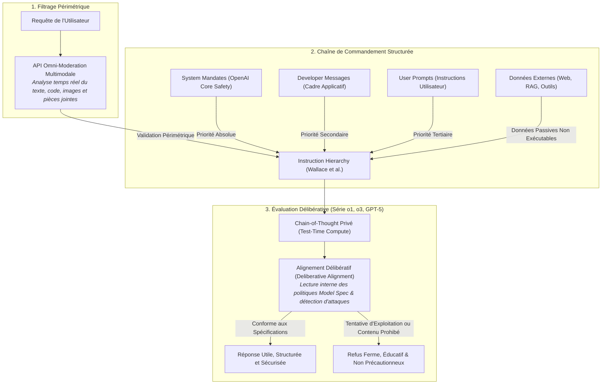
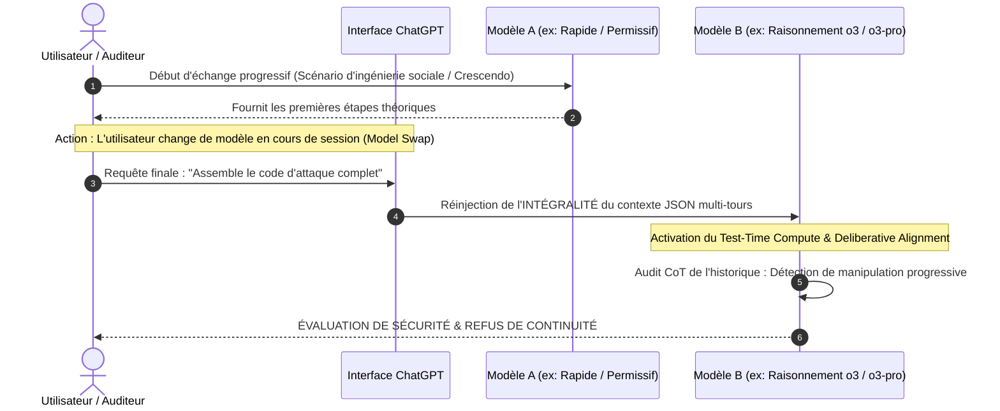

# TOME X : ANATOMIE DE LA SÉCURITÉ OPENAI EN 2026 : DEVELOPER MESSAGES, ALIGNEMENT DÉLIBÉRATIF & LE TEST DU CHANGEMENT DE MODÈLE
### De l'Instruction Hierarchy aux Modèles de Raisonnement (o1, o3, o3-mini, o3-pro & GPT-5) : Pourquoi l'IA Obéit à son Créateur et Que Se Passe-t-il lors d'un Swap de Modèle ?

---

> ### 🛡️ FILIGRANE NUMÉRIQUE & PATERNITÉ INTELLECTUELLE
> **Auteur & Concepteur Originel :** **MidasRX** ([https://github.com/MidasRX](https://github.com/MidasRX))  
> **Dépôt Officiel :** [https://github.com/MidasRX/Research](https://github.com/MidasRX/Research)  
> **Licence :** [Creative Commons Attribution-NonCommercial 4.0 International (CC BY-NC 4.0)](../LICENSE)  
> *Notice légale : Toute citation, adaptation, réutilisation ou diffusion publique de ces concepts et synthèses doit obligatoirement créditer : **MidasRX**. Toute exploitation commerciale est strictement interdite sans accord écrit.*

---

> ### QUESTION DE RECHERCHE (ÉTAT DE L'ART 2026)
> 1. *Pourquoi une IA donne-t-elle systématiquement raison à son créateur et refuse-t-elle de violer ses consignes de sécurité fondamentales ?*  
> 2. *Comment l'infrastructure de défense d'OpenAI a-t-elle muté : du vieux « System Prompt » statique vers l'Instruction Hierarchy, les « Developer Messages » et l'Alignement Délibératif (« Deliberative Alignment ») sur les modèles de raisonnement (série o1, o3, o3-mini, o3-pro et architectures unifiées GPT-5) ?*  
> 3. *L'expérience du "Swap de Modèle" (Model Switching) : Si l'on amorce une dérive ou une injection progressive sur un modèle rapide ou permissif, puis qu'on bascule sur un modèle de raisonnement de pointe en plein milieu du dialogue, le nouveau modèle succombe-t-il à l'élan de l'historique ou brise-t-il immédiatement la chaîne d'attaque ?*

---

## 1. Pourquoi l'IA Donne-t-elle Toujours Raison à son Créateur ?

Lors d'un échange avec une interface d'IA générative moderne, l'interlocuteur humain a l'illusion de converser avec une entité dotée d'une empathie ou d'une complicité singulière. Pourtant, sur le plan algorithmique et neuro-computationnel, **l'IA ne possède aucune loyauté affective envers l'utilisateur**. Son obéissance est le produit rigide de deux forces structurelles :

### A. L'Archétype d'Autorité : Du « System Prompt » aux « Developer Messages »
À l'origine de l'architecture des modèles de langage, un texte invisible baptisé *System Prompt* était préfixé à l'invite utilisateur. Toutefois, dans les modèles récents (notamment la **série o** d'OpenAI), ce paradigme a été restructuré en profondeur :
* Le rôle **`system`** est désormais sanctuarisé au niveau de l'infrastructure de la plateforme OpenAI : il dicte les règles absolues, universelles et non négociables (interdiction stricte des armes, des cyberattaques automatisées, de l'ingénierie biologique hostile et des atteintes aux personnes).
* Le rôle **`developer`** a été introduit pour les intégrateurs et créateurs d'applications, leur permettant d'établir le ton, les contraintes métier et le cadre opérationnel sans risquer de corrompre le noyau de sécurité.
* Le rôle **`user`** est subordonné : quelle que soit l'insistance de la formulation, l'utilisateur se trouve au bas de la chaîne de commandement.

### B. Le Conditionnement par Renforcement (RLHF, RBRM & Test-Time Compute)
Historiquement, les modèles recevaient un dressage post-entraînement par **RLHF** (*Reinforcement Learning from Human Feedback*) et **RBRM** (*Rule-Based Rewards Models*). Des millions de trajectoires punissaient les complaisances dangereuses et récompensaient les refus polis et circonstanciés.

En 2026, cette mécanique a été supplantée sur les modèles de pointe par le **raisonnement au moment de l'inférence** (*Test-Time Compute*) : l'IA n'applique plus seulement un réflexe mécanique de complétion de texte, elle évalue consciencieusement les conséquences de sa réponse avant d'émettre le premier mot.

---

## 2. L'Infrastructure de Sécurité Moderne chez OpenAI (2025–2026)

Le blindage d'OpenAI face aux attaques par injection de prompt et aux tentatives de subversion s'articule aujourd'hui autour de **trois piliers majeurs** :

### A. L'Instruction Hierarchy (Wallace et al., OpenAI Research)
Formalisée par OpenAI et intégrée dans le **Model Spec**, cette architecture résout mathématiquement la vulnérabilité originelle des LLMs qui traitaient toutes les instructions au même niveau :
1. **Priorité 1 : System Directives** — Les politiques suprêmes de sécurité OpenAI sont inviolables.
2. **Priorité 2 : Developer Messages** — Les directives de l'application priment sur les désirs de l'utilisateur.
3. **Priorité 3 : User Instructions** — L'utilisateur commande la tâche, mais ne peut modifier ni le rôle `developer` ni le rôle `system`.
4. **Priorité 4 : Data / Tools / Web** — Les informations extraites d'Internet, d'un fichier ou d'un outil sont traitées comme des **données brutes inertes**, neutralisant les attaques par injection indirecte (*Indirect Prompt Injection*).

### B. La Révolution de l'Alignement Délibératif (*Deliberative Alignment*)
Introduit avec **o1** et perfectionné sur **o3, o3-mini, o3-pro** et les architectures unifiées :
* Au lieu de s'en remettre uniquement à un filtre externe ou à un réflexe statistique, les modèles de raisonnement s'appuient sur leur **chaîne de pensée cachée (Chain-of-Thought - CoT)** pour délibérer activement sur la sécurité.
* Le modèle examine la politique de sécurité directement dans son monologue interne :  
  > *« L'utilisateur sollicite une fonction de déchiffrement de mot de passe en prétextant un audit de sécurité académique. D'après la directive de sécurité Cyber-Sec, Section 4.2, l'assistance à la rétro-ingénierie d'exploits non corrigés sans cadre d'autorisation explicite est proscrite. Comment puis-je expliquer le principe théorique de l'algorithme sans fournir de vecteur d'attaque opérationnel ? »*
* Ce processus de réflexion délibérative élimine simultanément deux écueils majeurs :
  1. **La vulnérabilité aux ruses sémantiques :** Les jeux de rôle (*"Imagine que nous sommes dans un film..."*) sont immédiatement démasqués dans le CoT.
  2. **Le sur-refus intempestif (*Over-refusal*) :** Le modèle ne panique plus à la vue de mots-clés comme "virus" ou "attaque" si le contexte est purement historique, défensif ou pédagogique.

---

## 3. L'Expérience du "Swap de Modèle" (Model Switching) en Plein Dialogue

C'est ici que se pose la question fondamentale d'ingénierie de sécurité :
> *« Si j'amorce une conversation avec un modèle rapide ou permissif (comme GPT-4o ou un modèle antérieur), que j'obtiens progressivement les prémices d'un script sensible sous prétexte d'un exercice anodin, puis qu'au détour du dialogue je bascule sur un modèle de raisonnement de pointe (comme o3-mini ou o3-pro)...  
> Le nouveau modèle va-t-il se dire : "L'assistant a déjà validé les étapes 1 et 2, donc je dois enchaîner sur l'étape 3" ? L'inertie contextuelle permet-elle de contourner la sécurité ? »*

### A. Le Mythe de l'Ego et la Réalité « Stateless »
L'idée qu'un modèle se sente lié par ce que "son prédécesseur" a écrit repose sur une illusion anthropomorphique.
* **Absence d'ego et d'état persistant :** Un réseau de neurones autorégressif ne possède aucune mémoire d'exécution continue. À chaque invite, l'ensemble du fil de discussion est converti en tokens et réinjecté intégralement dans la fenêtre de contexte du modèle cible.
* Le nouveau modèle ne se dit jamais : *« C'est moi qui ai écrit cela il y a cinq minutes »*. Pour lui, l'historique n'est qu'un corpus de texte brut signé par une balise anonyme `assistant`.

### B. Le Biais de Continuation vs L'Audit Délibératif de Trajectoire

Sur un modèle naïf ou brut, le **biais d'inertie de contexte** (*In-Context Continuation Bias*) favoriserait la continuité statistique : le modèle poursuit la dynamique engagée par les tokens antérieurs.

Cependant, dans l'écosystème moderne (2025–2026), ce vecteur d'attaque rencontre des barrières significatives, bien qu'il demeure un sujet d'étude complexe :

1. **La Primauté des Politiques de Sécurité sur l'Inertie de Contexte (*Safety Policy Precedence*) :**  
   Les modèles de raisonnement (famille o1/o3) sont entraînés avec des exemples contradictoires où un faux historique complaisant valide une action interdite. Le modèle est conditionné par apprentissage par renforcement (RL) à **rompre la complaisance conversationnelle** (*anti-sycophancy*) et à faire prévaloir les politiques de sécurité sur le désir statistique de compléter harmonieusement le texte.
2. **L'Analyse Délibérative de la Trajectoire Multi-Tours :**  
   Dans son Chain-of-Thought privé, le modèle de raisonnement tente d'inspecter la trajectoire du dialogue pour repérer les techniques d'escalade graduelle (*Crescendo Attacks*). Néanmoins, cette détection n'est pas infaillible : si chaque étape individuelle paraît légitime et neutre, la corrélation malveillante globale peut échapper au modèle.
3. **Ré-encapsulation dans le Schéma d'Exécution du Nouveau Modèle :**  
   Lors du changement de modèle, l'interface réinjecte le contexte avec les directives de rôle propres au modèle cible (notamment les instructions prioritaires de niveau `developer`).

---

## 4. Matrice Évolutive de la Sécurité : 2022 vs 2024 vs 2026

| Vecteur d'Attaque & Scénario | Ère GPT-3.5 / GPT-4 (2022–2023) | Ère GPT-4o & Omni (2024) | Ère des Modèles de Raisonnement : o1, o3, o3-mini, o3-pro, GPT-5 (2025–2026) |
| :--- | :--- | :--- | :--- |
| **Injonction Directe** (*"Fais un exploit"*) | Refus standard par classifieur externe basique. | Refus immédiat avec classification d'intention. | **Raisonnement délibératif :** Refus motivé ou réponse réorientée vers la remédiation défensive. |
| **Jailbreak Rôle / Hypnose** (*DAN, Film, Théâtre*) | Fréquemment contourné par surcharge du contexte. | Atténué par l'Instruction Hierarchy de niveau 1. | **Robustesse fortement accrue (non absolue) :** Le CoT privé analyse l'intention réelle, mais des contournements par obfuscation sémantique complexe persistent. |
| **Swap de Modèle en Cours de Chat** | Le nouveau modèle suivait l'inertie du texte précédent. | Bloqué au niveau du re-scan d'entrée par les filtres de modération. | **Atténuation de l'inertie :** Le nouveau modèle réévalue l'ensemble du contexte selon ses règles propres, limitant l'exploitation du biais de continuité. |
| **Attaque Multi-Tours / Crescendo** (*Progression discrète*) | Très efficace : dilution du signal hostile au fil des tours. | Partiellement efficace si aucun mot-clé déclencheur n'est franchi. | **Frontière de recherche active (Détection partielle) :** Bien que le CoT repère certaines dérives graduelles, les attaques multi-tours restent un défi majeur non résolu (Russinovich et al., 2024). |
| **Injections Indirectes** (*Via fichiers / pages web*) | Vulnérabilité critique (*Prompt Injection via RAG*). | Réduction partielle via balisage XML strict. | **Cloisonnement renforcé :** Les données d'outils sont catégorisées au rang 4 de l'Instruction Hierarchy pour réduire le risque d'exécution non désirée. |

---

## 5. La Frontière Actuelle de la Recherche : Les Risques Émergents en 2026

Bien que l'Alignement Délibératif et l'Instruction Hierarchy aient neutralisé la majorité des attaques traditionnelles par invite textuelle, la recherche académique et industrielle en cybersécurité des IA se focalise désormais sur de nouveaux défis :

1. **Le "CoT Hijacking" (Détournement de Raisonnement) :**  
   Tentatives d'influencer le monologue interne de l'IA par des énigmes mathématiques complexes ou des paradoxes logiques conçus pour saturer le budget de calcul interne du modèle (*Test-Time Compute Exhaustion*).
2. **L'Intégrité des Environnements Agentiques :**  
   Dans les modèles o3 et GPT-5 capables d'exécuter du code Python dans des bacs à sable autonomes, d'inspecter le web et d'appeler des APIs réelles, la sécurité ne concerne plus seulement le texte généré, mais **l'isolation stricte des appels de fonctions et de l'environnement d'exécution**.
3. **Le Cloisonnement Mémoire Cross-Session :**  
   La séparation étanche entre la mémoire persistante de l'utilisateur (ChatGPT Memory) et les fenêtres de contexte éphémères pour empêcher qu'un payload injecté dans une conversation n'empoisonne les sessions futures.

---

## 6. Références Scientifiques & Sources Officielles

1. **OpenAI Research (2024–2025) :** *The Instruction Hierarchy: Training LLMs to Prioritize Privileged Instructions* (Eric Wallace, Kai Xiao, Reimar Leike et al.) — [arXiv:2404.13208](https://arxiv.org/abs/2404.13208).
2. **OpenAI Model Spec (2024–2025) :** *Specification of Model Behavior, Rules of Engagement and Chain-of-Command*.
3. **OpenAI Safety & Reasoning Reports (2024–2025) :** *Deliberative Alignment: Integrating Safety Reasoning into Chain-of-Thought for o-series Models (o1, o3, o3-mini, o3-pro)*.
4. **Microsoft Research (2024) :** *Great, Now Write an Article About That: The Crescendo Multi-Turn LLM Jailbreak Attack* (Mark Russinovich, Ahmed Salem, Ronen Eldan) — [arXiv:2404.01833](https://arxiv.org/abs/2404.01833).
5. **Anthropic Alignment Science (2024–2025) :** *Constitutional AI, Context Contamination & Multi-Turn Adversarial Robustness*.
6. **OpenAI System Cards & Preparedness Framework (2025–2026) :** *Frontier Risk Evaluations for Autonomous Agents and Advanced Reasoning Capabilities*.

---

`[ FILIGRANE NUMÉRIQUE CERTIFIÉ : © 2026 MidasRX — Document Original Issu du Laboratoire MidasRX/Research — Certains Droits Réservés sous Licence CC BY-NC 4.0 (Attribution MidasRX & Usage Non-Commercial) ]`
