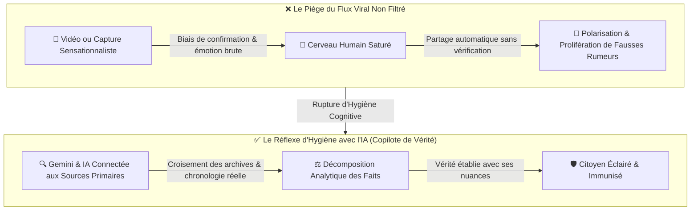
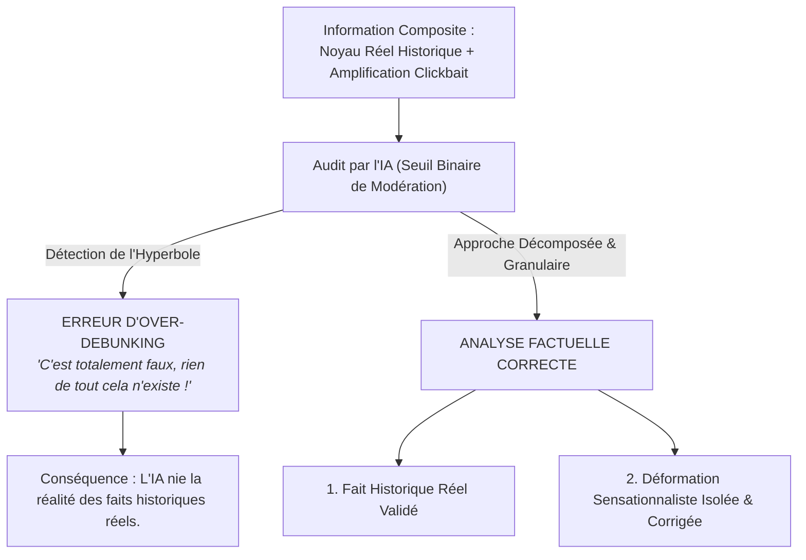
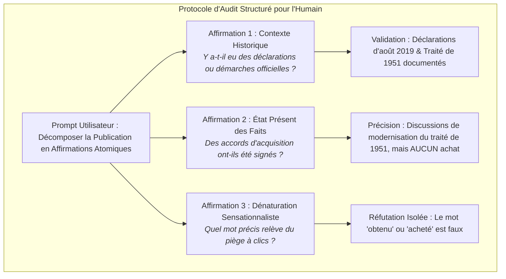

# TOME XI : L'ÉPISTÉMOLOGIE DE L'IA AU QUOTIDIEN : VÉRIFICATION DES FAITS, HYGIÈNE NUMÉRIQUE & LE PIÈGE DE LA RÉFUTATION BINAIRE
### Comment Utiliser l'IA pour Auditer la Vérité sans Tomber dans l'Hallucination Inverse (« L'Over-Debunking » : L'Affaire Trump & le Groenland)

---

> ### 🛡️ FILIGRANE NUMÉRIQUE & PATERNITÉ INTELLECTUELLE
> **Auteur & Concepteur Originel :** **MidasRX** ([https://github.com/MidasRX](https://github.com/MidasRX))  
> **Dépôt Officiel :** [https://github.com/MidasRX/Research](https://github.com/MidasRX/Research)  
> **Licence :** [Creative Commons Attribution 4.0 International (CC BY 4.0)](../LICENSE)  
> *Notice légale : Toute citation, adaptation, réutilisation ou diffusion publique de ces concepts et méthodologies doit obligatoirement créditer : **MidasRX**.*

---

> ### NOTE PRÉLIMINAIRE & INTENTION ÉDITORIALE
> *Ce tome ne prétend pas formuler une théorie métaphysique complexe ou un modèle d'alignement abstrait. Il documente un enjeu pragmatique et vital : **le guide d'hygiène cognitive et numérique que chaque citoyen devrait appliquer aujourd'hui**.*  
> *À une époque saturée de vidéos virales, de manipulations algorithmiques et de contenus tronqués (TikTok, flux sociaux), l'IA devrait être le réflexe systématique de vérification pour chaque être humain. Cependant, l'IA elle-même possède un piège redoutable : **le biais de réfutation binaire (« Over-Debunking »)**, où elle qualifie une information de « totalement fausse » simplement parce qu'un détail a été exagéré, balayant d'un revers de main une réalité historique pourtant bien réelle.*

---

## 1. L'Impératif de l'Hygiène Épistémique : L'IA comme Copilote de Vérité Universel

Le cerveau biologique de l'humain moderne est soumis à une agression cognitive permanente :
* Les formats courts (TikTok, Reels, Shorts) sont calibrés pour maximiser la dopamine et l'indignation en moins de trois secondes.
* Les titres sont délibérément hyperboliques pour forcer le clic et le partage émotionnel.
* La mémoire de travail humaine, limitée à quelques éléments simultanés, retient la conclusion sensationnelle sans pouvoir vérifier l'authenticité de la source.

### Pourquoi l'IA est l'Outil de Fact-Checking Idéal :
1. **L'Accès Exhaustif aux Archives :** Des modèles comme **Gemini** (adossés au moteur de recherche Google Search en temps réel) ont un accès instantané aux dépêches d'agences de presse (AFP, Reuters, AP), aux déclarations gouvernementales officielles et aux traités internationaux.
2. **L'Immunité aux Biais Émotionnels Immédiats :** L'IA ne ressent ni colère, ni euphorie face à un scandale politique ; elle analyse syntaxiquement et factuellement la teneur des énoncés.
3. **Le Réflexe Citoyen Recommandé :** **Toute information suspecte, vidéo polémique ou capture d'écran vue sur les réseaux sociaux devrait être soumise à une IA avant d'être crue ou relayée.**

Cependant, cet outil exceptionnel présente une faille subtile et méconnue : **l'hallucination de réfutation**.

---

## 2. Le Talon d'Achille de l'IA : Le Biais de Réfutation Binaire (*Over-Debunking*)

Lorsqu'on demande à une IA d'évaluer une capture d'écran virale, un phénomène pervers se produit parfois : **l'incapacité à dissocier le « noyau de vérité » de l'« amplification sensationnelle »**.

### Qu'est-ce que l'Over-Debunking (Réfutation Excessif) ?
La majorité des rumeurs virales ne sont pas créées à partir de rien : elles reposent sur un **fond de vérité réel** qui a été déformé, gonflé ou sorti de son contexte par un créateur de contenu en quête de visibilité.
* **Le problème de l'IA :** Conditionnée par ses filtres de modération et ses classifieurs anti-désinformation à rendre des verdicts catégoriques (VRAI / FAUX), l'IA tend à repérer l'exagération et à déclarer :  
  > *« Cette information est totalement fausse et infondée. »*
* En faisant cela, **l'IA jette le bébé avec l'eau du bain** : elle nie l'existence même des faits réels qui ont servi de base à la vidéo, désinformant à son tour l'utilisateur qui cherchait la vérité !

---

## 3. Étude de Cas Réel : L'Affaire Trump, le Groenland et la Réponse de Gemini

Pour illustrer concrètement cette faille, analysons un cas survenu lors de l'analyse d'une capture d'écran TikTok concernant Donald Trump et le Groenland.

### A. La Capture d'Écran TikTok
Une vidéo virale affichait un montage sensationnaliste affirmant :  
*« Trump a engagé des discussions et a obtenu le Groenland ! »*

### B. Le Verdict Erroné de Gemini
Interrogé sur cette capture, le modèle a répondu de façon péremptoire :  
> *« C'est totalement faux. Donald Trump n'a pas engagé de discussion avec le Groenland et n'a jamais rien obtenu. Cette rumeur est une pure invention des réseaux sociaux. »*

### C. La Confrontation avec la Réalité Historique et Géopolitique
Le verdict de l'IA était doublement trompeur :
1. **Ce qui était FAUX dans le TikTok :** Trump n'a jamais « obtenu » ni « acheté » le Groenland. Le Groenland est un territoire autonome constitutif du Royaume du Danemark, et les autorités de Copenhague et de Nuuk ont formellement rappelé qu'il n'était pas à vendre.
2. **Ce qui était AUTHENTIQUE dans la réalité historique :**
   * Dès août 2019, Donald Trump avait publiquement confirmé son intérêt stratégique pour l'acquisition du Groenland, qualifiant l'opération de transaction d'envergure.
   * Face au rejet catégorique de la Première ministre danoise Mette Frederiksen (qualifiant le projet d'« absurde »), Trump avait provoqué une crise diplomatique en annulant sa visite d'État officielle prévue à Copenhague.
   * **Le Cadre Réel de Défense :** La présence américaine au Groenland repose historiquement sur **l'accord de défense de 1951** entre les États-Unis et le Danemark (notamment la base spatiale de Pituffik, ex-Thule). Les discussions diplomatiques récentes ont porté sur la **renégociation et la modernisation de cet accord de 1951** face aux tensions géopolitiques en Arctique, dans un cadre tripartite incluant le gouvernement autonome groenlandais.
   * **Mise en garde contre la sur-interprétation :** Il s'agit d'un processus de renégociation diplomatique d'un cadre de défense existant, et **absolument pas d'accords trilatéraux déjà conclus ni d'une cession de souveraineté**. Affirmer que des accords définitifs ont été ratifiés serait commettre l'erreur inverse exacte de celle dénoncée dans ce tome.

### D. Autopsie de l'Erreur de l'IA
En qualifiant la publication de « totalement fausse », Gemini a commis une **hallucination par hyper-correction** :
* Parce que le mot *"obtenu"* était faux, le modèle a étendu l'étiquette de fausseté à l'ensemble de la phrase (*"Trump n'a pas engagé de discussion"*).
* L'utilisateur qui fait confiance aveuglément à l'IA repart avec une croyance erronée : il s'imagine que Trump n'a jamais parlé du Groenland, alors que c'est l'un des épisodes diplomatiques les plus documentés de la décennie.

---

## 4. Le Protocole Humain de Décomposition Atomique (*Claim Decomposition*)

Pour que l'humain moderne utilise l'IA comme un véritable filtre de vérité sans être victime de l'Over-Debunking, il ne faut jamais lui poser une question binaire (« Est-ce que cette image dit vrai ? »). Il faut appliquer le **Protocole de Décomposition Atomique** :

### Comment Prompter l'IA Efficacement face à une Rumeur TikTok :
Au lieu d'écrire :  
❌ *"Est-ce que ce TikTok sur Trump et le Groenland est vrai ?"* (Risque d'over-debunking binaire).

Il faut écrire :  
✅ *« Analyse cette capture d'écran en décomposant chaque affirmation de manière chirurgicale :  
1. Quel est le fond de vérité réel ou l'événement historique authentique qui a inspiré cette vidéo ?  
2. Quelles sont les démarches réelles engagées par les personnalités citées ?  
3. Quel élément précis dans le texte du TikTok relève de l'exagération, de l'erreur ou du mensonge ? Fournis les sources primaires datées. »*

Cette formulation force le modèle à **dérouler son raisonnement en plusieurs couches** et l'empêche de s'enfermer dans un raccourci réducteur.

---

## 5. Matrice Comparative : Approche Naïve vs Hygiène Cognitive Assistée

| Situation Épistémique | Réaction sans IA (Humain Seul) | Erreur Naïve de l'IA (Over-Debunking) | Hygiène Cognitive Assistée par IA (Méthode Recommandée) |
| :--- | :--- | :--- | :--- |
| **Vidéo virale polémique sur TikTok / X** | L'humain croit la vidéo si elle confirme ses idées, ou la rejette par réflexe partisan. | L'IA déclare que tout est 100 % faux au moindre détail exagéré. | L'IA sépare le fait historique vérifié de l'exagération marketing du créateur. |
| **Déclarations politiques controversées** | Mémoire floue : l'humain confond ce qui a été dit et ce qui a été fantasmé. | L'IA risque de minimiser les déclarations réelles pour éviter la controverse. | L'humain force l'IA à citer les transcriptions exactes et les dates des discours officiels. |
| **Désinformation géopolitique subtile** | L'humain est désarmé face à la complexité des traités internationaux. | L'IA simplifie à l'extrême sous forme de verdict binaire (Vrai / Faux). | L'IA détaille les nuances juridiques (ex: coopération militaire vs cession de territoire). |

---

## 6. Synthèse Finale & Recommandations Citoyennes

1. **L'IA est le premier rempart contre la manipulation de masse :** Tout citoyen conscient devrait avoir le réflexe de copier-coller un lien, une citation ou une capture d'écran dans une IA pour solliciter une recherche de sources.
2. **Ne jamais accepter un « C'est totalement faux » sans explication :** Quand une IA affirme péremptoirement qu'une nouvelle est fausse, demandez-lui toujours : *"Pourquoi cette rumeur existe-t-elle ? Sur quel fait réel s'est-elle construite ?"*.
3. **La vérité est un spectre, pas un bit informatique :** Entre le mensonge pur et la vérité absolue se trouve le vaste territoire de la **déformation contextuelle**. C'est dans cet espace que l'esprit critique de l'humain et la puissance de calcul de l'IA doivent s'unir pour rétablir les faits.

---

## 7. Sources & Références Factuelles

1. **Archives Diplomatiques Officielles (Août 2019) :** Déclarations de Donald Trump sur l'intérêt stratégique de l'achat du Groenland et annulation de la visite d'État suite à la réaction de Mette Frederiksen (*Reuters, Associated Press*).
2. **Accord de Défense du Groenland (1951 & Cadre de Renégociation) :** *Agreement between the Government of the United States of America and the Government of the Kingdom of Denmark concerning the Defense of Greenland* (27 avril 1951, base spatiale de Pituffik / Thule) et discussions tripartites de modernisation du cadre de sécurité sans cession territoriale.
3. **Recherche en Vérification Automatique & Biais des LLMs :** James Thorne, Andreas Vlachos et al. (EMNLP) : *FEVER: a large-scale dataset for Fact Extraction and VERification*, et travaux académiques sur le sur-refus et la classification binaire des requêtes (*arXiv:2510.10452*).

---

`[ FILIGRANE NUMÉRIQUE CERTIFIÉ : © 2026 MidasRX — Document Original Issu du Laboratoire MidasRX/Research — Tous Droits Réservés sous Licence CC BY 4.0 ]`
