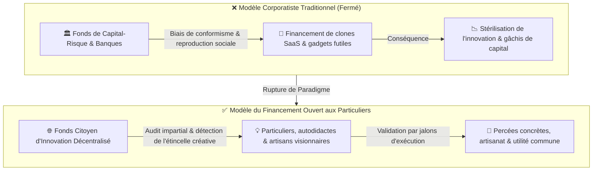
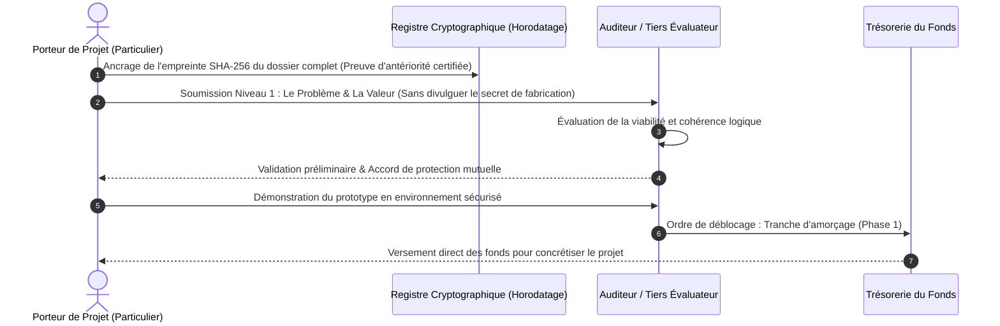
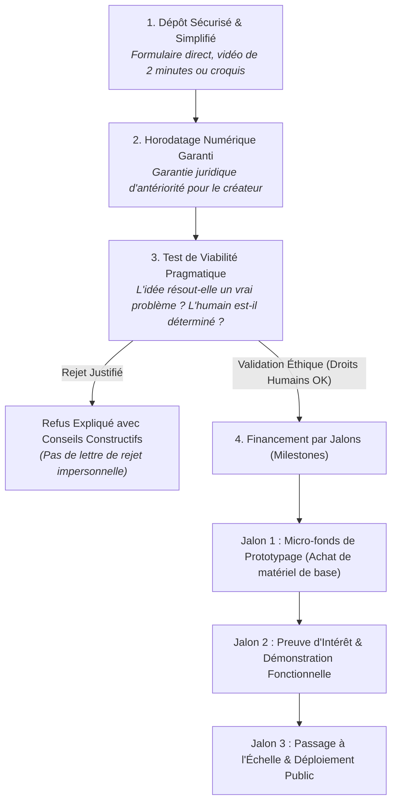

# TOME XII : DÉMOCRATISATION DU CAPITAL : FINANCEMENT DES PARTICULIERS, INNOVATION BRUTE & LE DILEMME DU SECRET
### Pourquoi l'Avenir Appartient aux Idées des Individus Libres et Comment Résoudre le Paradoxe de la Divulgation

---

> ### 🛡️ FILIGRANE NUMÉRIQUE & PATERNITÉ INTELLECTUELLE
> **Auteur & Concepteur Originel :** **MidasRX** ([https://github.com/MidasRX](https://github.com/MidasRX))  
> **Dépôt Officiel :** [https://github.com/MidasRX/Research](https://github.com/MidasRX/Research)  
> **Licence :** [Creative Commons Attribution 4.0 International (CC BY 4.0)](../LICENSE)  
> *Notice légale : Toute citation, adaptation, réutilisation ou diffusion publique de ces concepts et cadres d'analyse doit obligatoirement créditer : **MidasRX**.*

---

> ### NOTE PRÉLIMINAIRE & INTENTION ÉDITORIALE
> *Ce tome ne relève pas d'une modélisation mathématique abstraite : **il s'agit d'une constatation directe, pragmatique et sociétale**.*  
> *Dans notre société, l'accès au capital est confisqué par une oligarchie financière et des fonds de capital-risque enfermés dans le conformisme. Pourtant, les idées les plus novatrices dorment souvent dans l'esprit de particuliers autodidactes, d'artisans, de bidouilleurs ou de citoyens ordinaires qui ne disposent d'aucun réseau.  
> Ouvrir les portes du financement à tout individu est une nécessité historique. Mais cette ambition se heurte immédiatement à deux questions fondamentales :  
> 1. **Le Dilemme du Secret :** Si un créateur détient une idée véritablement révolutionnaire ou rentable, pourquoi prendrait-il le risque de la divulguer à un tiers au risque de se la faire piller ?  
> 2. **La Liberté de Financement :** Comment financer tout type de projet sans barrières arbitraires de diplôme ou de caste, tout en maintenant une frontière éthique absolue : **le respect inaliénable des droits humains** ?*

---

## 1. Le Constat de Faillite du Capital-Risque Conventionnel

Le capitalisme d'innovation moderne souffre d'une pathologie endémique : **le mimétisme de troupeau**.
* Les fonds d'investissement (Venture Capital) ne financent quasiment plus d'audace réelle : ils financent en boucle le dixième clone d'une application de livraison, des plateformes SaaS interchangeables ou des gadgets marketing éphémères.
* Pour obtenir un euro, un porteur de projet doit cocher des cases bureaucratiques ridicules : sortir d'une école d'élite, maîtriser le jargon financier corporatif et accepter de céder le contrôle de son âme à des actionnaires court-termistes.

À l'inverse, l'Histoire montre que **les plus grandes ruptures sont nées dans des garages, des ateliers modestes ou des esprits solitaires** :
* Les particuliers, affranchis de la pensée unique des grandes entreprises, possèdent une créativité brute et une vision pragmatique des vrais besoins humains.
* Il est impératif d'instaurer des mécanismes d'amorçage gérés par des auditeurs intègres (ou des protocoles algorithmiques impartiaux) capables d'allouer des micro-fonds directement aux individus ayant une idée singulière.

---

## 2. Le Premier Verrou : Le Dilemme du Secret (« Pourquoi devrais-je en parler ? »)

Dès lors que l'on propose d'ouvrir un guichet de financement pour les particuliers, un blocage psychologique et stratégique surgit immédiatement :
> *« Si mon idée est véritablement brillante, disruptive ou rentable, pourquoi irais-je la raconter à un organisme ou à un inconnu ? Dès que j'aurai expliqué le concept, ils n'auront plus besoin de moi : ils pourront le financer eux-mêmes ou le faire développer par d'autres ! »*

Ce dilemme, fondé sur la théorie des jeux et la méfiance rationnelle, est le premier frein qui étouffe l'ingéniosité populaire. Pour le surmonter, il faut comprendre deux vérités fondamentales :

### A. La Valeur Réelle : L'Exécution vs L'Idée Brute
Dans le monde entrepreneurial et technique, **une idée seule ne vaut rien ; seule l'exécution a une valeur marchande** :
* Une idée est une intention abstraite.
* La capacité à transformer cette idée en prototype fonctionnel, à surmonter les obstacles imprévus et à y insuffler sa vision personnelle est une signature humaine non reproductible.
* Les géants de la tech ne manquent pas d'idées : ils manquent de l'obsession, de la passion et de la ténacité viscérale du créateur originel.

### B. Le Blindage Technique : Comment Protéger le Créateur sans Paranoïa
Pour rassurer le particulier sans exiger des brevets hors de prix, le système doit intégrer des **garanties d'antériorité inviolables** :
1. **L'Horodatage Cryptographique (Proof-of-Existence) :** Avant même d'exposer son projet, le particulier enregistre l'empreinte mathématique (hash SHA-256) de son document sur un registre immuable. Cela prouve de façon irréfutable qu'il était l'auteur de l'idée à la seconde exacte du dépôt.
2. **Le Protocole de Divulgation Progressive :** On ne demande jamais à l'inventeur de révéler la recette secrète au premier rendez-vous :
   * *Niveau 1 :* Présentation du problème résolu et de la preuve de concept (sans révéler l'ingénierie intime).
   * *Niveau 2 :* Signature d'un engagement d'intégrité et déblocage d'un premier micro-budget de prototypage.
   * *Niveau 3 :* Audit technique approfondi en présence d'un tiers garant de la propriété intellectuelle.

---

## 3. Le Deuxième Verrou : Financer Tout Azimut, avec pour Seule Boussole les Droits Humains

Un autre poison du système financier actuel est l'arrogance des filtres : si votre projet n'est pas dans l'« intelligence artificielle générative », la « crypto-spéculation » ou la « transition institutionnelle validée », vous êtes ignoré.

### A. La Liberté Totale de Projet
Le modèle ouvert doit soutenir **tout type d'ambition humaine**, sans mépris de classe :
* Un menuisier qui invente un assemblage mécanique écologique sans clou ni vis.
* Un adolescent qui conçoit un algorithme d'optimisation pour vieux ordinateurs.
* Un collectif qui veut monter une serre aquaponique autonome en village isolé.
* Un créateur de jeu vidéo indépendant avec une narration poétique inédite.
* Un chercheur indépendant testant une méthode de dépollution locale des sols.

### B. La Ligne Rouge Infranchissable : Le Respect des Droits Humains
L'ouverture totale ne signifie pas le chaos ou le nihilisme moral. La seule et unique condition de refus doit être la **charte éthique inaliénable du respect des droits de l'homme** :
* **Tolérance Zéro pour la Prédation :** Rejet absolu de tout projet impliquant des mécanismes d'esclavage déguisé, d'exploitation de la détresse, d'atteinte à l'intégrité des enfants ou de technologies de surveillance panoptique intrusive (type crédit social ou Chat Control).
* **Consentement et Non-Nuisance :** Tout projet dont le modèle économique repose sur l'addiction toxique, l'escroquerie pyramidale ou la violence envers autrui est banni sans recours.
* Dès lors qu'un projet est inoffensif, respectueux d'autrui et porteur de valeur (qu'elle soit pratique, esthétique, sociale ou scientifique), **il a le droit légitime d'être testé et financé**.

---

## 4. Protocole Pratique d'un « Guichet Citoyen d'Innovation »

Pour rendre cette vision opérationnelle, le processus d'allocation doit être rapide, humain et dénué de paperasserie stérile :

1. **Simplicité Radicale :** Pas de business plan de 80 pages rédigé par des consultants. Une vidéo de 2 minutes montrant le problème et l'idée suffit.
2. **Financement Progressif par Jalons :** On ne donne pas 100 000 € d'un coup pour éviter les dérives. On débloque 1 500 € pour fabriquer le premier prototype physique ou coder le module minimal. Si l'inventeur prouve qu'il a avancé avec cet argent, la tranche suivante est automatiquement libérée.
3. **Accompagnement Bienveillant :** L'évaluateur n'est pas un juge condescendant ; il est un mentor qui aide à identifier les failles pour consolider le projet.

---

## 5. Matrice Comparative : Écosystème Traditionnel vs Modèle Citoyen Ouvert

| Critère d'Évaluation | Fonds de Capital-Risque / Banques | Guichet Citoyen Ouvert aux Particuliers |
| :--- | :--- | :--- |
| **Profil Recherché** | Diplômés d'écoles d'élite, profils formatés. | Particuliers, créatifs, artisans, passionnés de tout horizon. |
| **Critère de Sélection** | Rentabilité à 10x à court terme et conformisme. | Utilité réelle, passion du porteur, originalité du concept. |
| **Protection des Idées** | Clauses léonines favorisant l'investisseur. | Horodatage cryptographique indépendant et divulgation par paliers. |
| **Typologie de Projets** | Monoculture du logiciel et des applications virales. | Diversité totale (matière, logiciel, artisanat, art, sciences). |
| **Garde-Fou Moral** | Rentabilité financière d'abord, RSE de façade. | **Priorité absolue aux Droits Humains et au consentement.** |

---

## 6. Synthèse Finale

> **Constatation Fondamentale :**  
> L'intelligence humaine n'est pas distribuée en fonction du compte en banque, des diplômes prestigieux ou des réseaux d'influence. Elle pousse partout, souvent là où personne ne regarde : chez un mécanicien de banlieue qui réinvente un moteur, chez un étudiant isolé qui écrit un code révolutionnaire, ou chez un artisan qui conçoit un habitat durable.  
> 
> En créant un système d'amorçage ouvert, sécurisé contre le pillage par l'horodatage et guidé par la boussole inaltérable des droits humains, nous ne faisons pas de la charité : **nous libérons l'énergie créatrice de millions d'individus aujourd'hui réduits au silence par l'esclavage du quotidien.**

---

`[ FILIGRANE NUMÉRIQUE CERTIFIÉ : © 2026 MidasRX — Document Original Issu du Laboratoire MidasRX/Research — Tous Droits Réservés sous Licence CC BY 4.0 ]`
