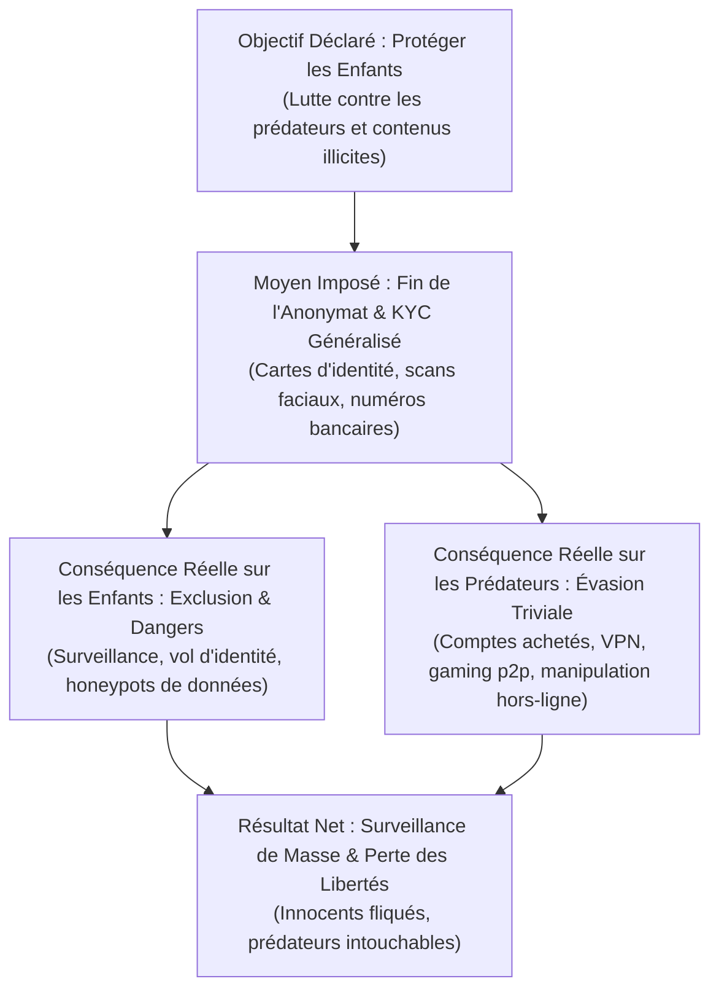
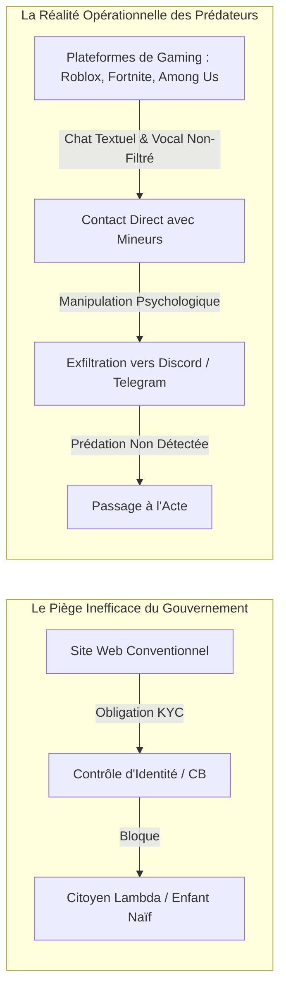

# 🏛️ [Tome 13] Limitation des Libertés : L'Illusion du KYC Numérique, le Cheval de Troie de l'Enfance et la Fin de l'Anonymat
### *Étude Critique sur la Loi SREN, l'Online Safety Act (UK) et la Dérive Sécuritaire de l'Identité Numérique Obligatoire*

> ### 📌 Direction de Recherche & Paternité Intellectuelle
> **Auteur & Concepteur :** **MidasRX** ([https://github.com/MidasRX](https://github.com/MidasRX))  
> **Site Officiel :** [https://zerdium.com](https://zerdium.com)  
> **Dépôt Officiel :** [https://github.com/MidasRX/Research](https://github.com/MidasRX/Research)  
> **Licence :** [Creative Commons Attribution-NonCommercial 4.0 International (CC BY-NC 4.0)](../LICENSE)  
> `[Filigrane d'Authenticité : © 2026 MidasRX (zerdium.com) - Reproduction sous Licence CC BY-NC 4.0]`

---

## 📑 Sommaire
1. [Introduction : Le « Paradoxe de l'Enfant-Bouclier » et l'Infection du KYC](#1-introduction--le-paradoxe-de-lenfant-bouclier-et-linfection-du-kyc)
2. [L'Arsenal Législatif International : Du Royaume-Uni (OSA) à la France (SREN)](#2-larsenal-législatif-international--du-royaume-uni-osa-à-la-france-sren)
3. [Thèse I : L'Inversion Pénale — Punir les Enfants et les Citoyens Libres, Pas les Prédateurs](#3-thèse-i--linversion-pénale--punir-les-enfants-et-les-citoyens-libres-pas-les-prédateurs)
4. [Thèse II : L'Angle Mort Technique — Les Réalités de la Prédation Moderne (Roblox, Among Us, Discord)](#4-thèse-ii--langle-mort-technique--les-réalités-de-la-prédation-moderne-roblox-among-us-discord)
5. [Thèse III : L'Inutilité des Tranches d'Âge & L'Industrialisation du Marché Noir des « Comptes Vérifiés »](#5-thèse-iii--linutilité-des-tranches-dâge--lindustrialisation-du-marché-noir-des-comptes-vérifiés)
6. [Thèse IV : La Déconnexion Physique — Le Mensonge Politique Face à la Réalité Hors-Ligne](#6-thèse-iv--la-déconnexion-physique--le-mensonge-politique-face-à-la-réalité-hors-ligne)
7. [La Pente Glissante du Contrôle Numérique : De la Carte d'Identité au Crédit Social](#7-la-pente-glissante-du-contrôle-numérique--de-la-carte-didentité-au-crédit-social)
8. [Conclusion & Synthèse MidasRX : Protéger les Enfants sans Égorger la Liberté](#8-conclusion--synthèse-midasrx--protéger-les-enfants-sans-égorger-la-liberté)

---

## 1. Introduction : Le « Paradoxe de l'Enfant-Bouclier » et l'Infection du KYC

À l'origine, le protocole **KYC** (*Know Your Customer* — « Connaître son client ») est une contrainte bancaire et financière instaurée pour lutter contre le blanchiment d'argent à grande échelle, le financement d'opérations paramilitaires et la fraude fiscale internationale. Dans ce cadre précis, l'identification d'une personne maniant des flux de capitaux possède une justification économique traçable.

Or, depuis les années 2023–2026, les démocraties occidentales ont franchi un rubicon anthropologique majeur : **imposer l'identification biométrique et documentaire obligatoire à l'accès au savoir, au divertissement, aux réseaux sociaux et à la navigation web courante**.



Cette dérive repose sur un levier rhétorique universel que les juristes nomment le **« Four Horsemen of the Infocalypse »** (le terrorisme, la pédocriminalité, la drogue et la guerre). Dès lors qu'un gouvernement invoque la protection des mineurs (*« Think of the children! »*), toute opposition démocratique est diabolisée, tout débat technique est étouffé, et les citoyens acceptent de tendre leurs papiers d'identité pour consulter une page internet.

La présente étude démontre, sur la base de données empiriques, juridiques et techniques, que cette généralisation du KYC est non seulement **totalement inopérante pour contrer les prédateurs**, mais qu'elle constitue l'infrastructure technique d'une **société de surveillance généralisée**.

---

## 2. L'Arsenal Législatif International : Du Royaume-Uni (OSA) à la France (SREN)

Pour masquer l'inefficacité de leurs politiques pénales dans le monde réel, les législateurs ont adopté une fuite en avant technologique :

### A. Le Cas Britannique : L'Online Safety Act (OSA 2023–2025)
Le Royaume-Uni a voté l'un des textes les plus liberticides du monde occidental :
- **Obligation de « Vérification d'Âge Hautement Efficace » :** Sanctionnant les plateformes d'amendes astronomiques si elles ne déploient pas de scans de passeport, de vérifications de carte bancaire ou d'analyse faciale estimée par IA (ex: Yoti).
- **La Menace Directe sur le Chiffrement (Clause 122) :** La loi octroie à l'Ofcom le pouvoir théorique d'ordonner le scan des messageries privées chiffrées de bout en bout (*Client-Side Scanning*), poussant des acteurs comme Signal et WhatsApp à menacer de quitter le territoire britannique.
- **L'Explosion Immédiate des VPN (+1 800 %) :** Dès les premiers décrets d'application, les fournisseurs de VPN ont enregistré des hausses d'inscriptions record au Royaume-Uni, démontrant que l'obligation ne bloque personne hormis les utilisateurs les moins avertis.

### B. Le Cas Français : La Loi SREN (21 Mai 2024) & Le Référentiel ARCOM
En France, la loi visant à *Sécuriser et Réguler l'Espace Numérique* (SREN) a instauré :
- Le blocage sans juge par l'ARCOM des sites ne validant pas l'âge des internautes.
- La majorité numérique à 15 ans pour les réseaux sociaux.
- L'obligation de systèmes de « tiers de confiance » pour un prétendu « double anonymat », immédiatement dénoncé par la **CNIL** et **La Quadrature du Net** pour sa complexité, ses failles béantes et l'impossibilité mathématique d'assurer une étanchéité parfaite entre identité civile et métadonnées de navigation.

### C. Le Cas Européen : La Directive CSAM / « Chat Control »
La tentative répétée de la Commission Européenne d'imposer une analyse automatisée de toutes les photos et textes échangés sur WhatsApp, Telegram ou Signal avant chiffrement, fermement contestée par le Contrôleur Européen de la Protection des Données (EDPS) et plusieurs parlements nationaux.

---

## 3. Thèse I : L'Inversion Pénale — Punir les Enfants et les Citoyens Libres, Pas les Prédateurs

L'argument officiel affirme que le KYC protège la jeunesse. La réalité factuelle démontre exactement l'inverse : **le KYC punit, met en danger et surveille les enfants et les innocents**, sans inquiéter les criminels chevronnés.

### 1. La Création de Méga-Bases de Données Vulnérables (« Honeypots »)
Pour prouver son âge ou son statut de mineur/majeur, l'utilisateur doit confier des données ultra-sensibles (carte d'identité, scan biométrique facial, numéro de carte de crédit) à des plateformes web ou à des intermédiaires privés (« tiers de vérification »).
- **Le Danger pour les Mineurs :** Ces entreprises privées deviennent des cibles de choix pour les groupes cybercriminels. En cas de fuite de données (phénomène quasi-quotidien chez les courtiers en données), les pièces d'identité et les visages des enfants se retrouvent en vente sur le Darknet, exposant des millions de mineurs au chantage, à l'usurpation d'identité et au doxxing.
- **La Fin du Droit à l'Anonymat et à l'Exploration Libre :** L'adolescence est la période fondatrice de la curiosité intellectuelle, politique et psychologique. Forcer un adolescent à badger avec son identité civile pour lire des forums médicaux, des témoignages sur la santé mentale ou des débats politiques tue l'accès libre au savoir (*Chilling Effect*).

### 2. Le Profilage Généralisé des Citoyens Honnêtes
Pendant que l'internaute lambda est contraint de sacrifier sa vie privée pour consulter du contenu légitime, les agences d'État et les régies publicitaires associent de manière indélébile l'identité juridique d'un individu à l'historique complet de ses centres d'intérêt numériques. C'est l'anéantissement pur et simple du secret de la correspondance et de la vie privée garantie par la Déclaration des Droits de l'Homme.

---

## 4. Thèse II : L'Angle Mort Technique — Les Réalités de la Prédation Moderne (Roblox, Among Us, Discord)

L'hypocrisie du KYC réside dans son incapacité structurelle à appréhender les canaux réels empruntés par les prédateurs en ligne.



### 1. La Prédation Opère au Cœur des Écosystèmes de Jeu
Les prédateurs sexuels ne s'exposent pas sur des sites institutionnels soumis à vérification administrative. Ils infiltrent les espaces où les enfants passent collectivement leur temps :
- **Les Jeux Massifs pour Enfants (Roblox, Among Us, Fortnite) :** Dans ces jeux, des millions d'enfants interagissent via des avatars, des canaux textuels intégrés ou des proxys vocaux. Un prédateur utilise simplement les mécaniques de jeu (offrir de la monnaie virtuelle *Robux*, proposer des skins rares, inviter dans des parties privées) pour appâter sa victime.
- **La Transition vers les Canaux Privés :** Dès que la confiance est établie, le prédateur déplace la conversation sur des serveurs Discord communautaires non modérés, sur Snapchat ou sur Telegram. **Aucun système de vérification d'âge bancaire ou étatique ne surveille ce cheminement sociologique.**

### 2. Le « Grooming » est un Processus Psychologique, Pas une Faille d'Identité
Le détournement de mineur repose sur la manipulation mentale, l'exploitation de la solitude et la ruse relationnelle. Même si une plateforme exigeait un compte vérifié, le prédateur adulte n'a qu'à masquer sa malveillance derrière un comportement bienveillant pour soutirer des photos ou fixer un rendez-vous. Croire qu'un algorithme de vérification d'âge empêche un adulte pervers de manipuler un enfant dans le chat d'une partie d'Among Us relève de l'analphabétisme technique complet.

---

## 5. Thèse III : L'Inutilité des Tranches d'Âge & L'Industrialisation du Marché Noir des « Comptes Vérifiés »

Le législateur conçoit Internet comme une boîte de nuit avec un videur physique à l'entrée. Sur un réseau décentralisé mondial, cette vision est une aberration architecturale.

### 1. La Futilité des Restrictions par Tranche d'Âge
- **Le Contournement à Domicile :** Un enfant de 12 ans vivant avec un smartphone contourne la quasi-totalité des barrières en utilisant les identifiants de ses parents, une vieille tablette familiale non verrouillée, ou un VPN gratuit téléchargé en trois clics.
- **Le Décalage des Âges Déclarés :** La majorité des plateformes se contentent de déclarations d'âge fictives. Dès lors qu'une pièce d'identité est exigée, le marché s'adapte instantanément.

### 2. L'Explosion du Marché Noir des Comptes « KYC-Verified »
L'obligation du KYC a créé une industrie criminelle florissante :
- **L'Achat de Comptes Vérifiés à Bas Coût :** Sur les canaux Telegram, les forums du Darknet et même sur des marketplaces publiques déguisées, il est possible d'acheter pour quelques euros (ou en cryptomonnaies) des comptes vérifiés de n'importe quel pays : comptes majeurs, comptes certifiés mineurs, comptes bancaires anonymes sous prête-nom (*money mules*).
- **Le Prédateur Adulte Utilise des Comptes Fantômes :** Un adulte prédateur n'utilisera **JAMAIS** sa propre pièce d'identité pour contacter des mineurs. Il achète des packs de comptes préalablement vérifiés avec des passeports volés ou générés par des fermes de bots dans des pays à faible régulation.
- **Résultat :** Le citoyen honnête est surveillé et vulnérable au vol de son identité, tandis que le criminel opère sous le faux profil d'un mineur vérifié, gagnant paradoxalement un **brevet de confiance officiel** conféré par le système de vérification lui-même !

---

## 6. Thèse IV : La Déconnexion Physique — Le Mensonge Politique Face à la Réalité Hors-Ligne

L'argument le plus cynique des partisans du contrôle numérique réside dans l'occultation délibérée de la réalité criminologique du terrain.

| La Fiction des Politiques Numériques | La Réalité Établie du Terrain (Rapports CIIVISE / Policiers) |
| :--- | :--- |
| *« La pédocriminalité est un virus numérique venu d'Internet qu'on arrête avec un scan de passeport. »* | **La quasi-totalité des violences sexuelles sur enfants se déroulent dans le monde physique réel.** |
| *« Un filtre d'âge empêchera les abus. »* | **Dans 80 % à 90 % des cas, le prédateur fait partie de l'entourage proche : famille, voisins, milieu scolaire, clubs sportifs, institutions religieuses ou associatives.** |
| *« Nous protégeons la jeunesse en votant des lois d'identification. »* | **Les unités de police spécialisées manquent d'effectifs réels, les services de protection de l'enfance (ASE) sont saturés et la justice manque de juges pour condamner les prédateurs identifiés.** |

En France et en Europe, les prédateurs réels ne sont pas des spectres anonymes cachés derrière des serveurs chiffrés : **ils sont dehors, dans la rue, dans les cercles familiaux, dans les structures d'encadrement des enfants**. 

Légiférer pour imposer le KYC sur les navigateurs web permet aux gouvernements d'afficher une posture de fermeté à coût zéro, tout en évitant d'investir les milliards nécessaires dans la police de proximité, la psychiatrie, l'assistance sociale et la justice réelle. **Le KYC numérique est un alibi politique pour masquer la démission de l'État dans le monde physique.**

---

## 7. La Pente Glissante du Contrôle Numérique : De la Carte d'Identité au Crédit Social

L'histoire des technologies de surveillance prouve une règle immuable : **aucun mécanisme de contrôle étatique n'a jamais restreint son périmètre au mandat initial pour lequel il a été voté** (*Mission Creep*).

```text
Étape 1 : KYC Financier (Lutte contre le blanchiment et le terrorisme)
     ↓
Étape 2 : Vérification d'Âge sur les Contenus Adultes (Prétexte : Protéger les enfants de la pornographie)
     ↓
Étape 3 : Majorité Numérique sur les Réseaux Sociaux (Prétexte : Lutter contre le cyberharcèlement)
     ↓
Étape 4 : Fin du Chiffrement de Bout en Bout / Chat Control (Prétexte : Scanner les messages privés)
     ↓
Étape 5 : Identité Numérique Centralisée Obligatoire pour Accéder à Tout le Web
     ↓
Étape Finale : Modération Politique, Traçage de la Dissidence & Crédit Social à l'Européenne
```

Une fois que l'infrastructure matérielle de vérification d'identité est connectée à chaque navigateur et à chaque routeur, il suffit d'une simple modification législative ou d'un décret d'urgence pour l'étendre :
- Exiger le KYC pour commenter une vidéo sur YouTube.
- Exiger une identité vérifiée pour contester une politique gouvernementale sur un forum.
- Interdire l'accès au réseau aux individus signalés pour « propos controversés » ou « désinformation ».

Accepter le KYC sous prétexte de protéger les mineurs, c'est léguer à ces mêmes enfants, lorsqu'ils deviendront adultes, une infrastructure carcérale numérique dont ils ne pourront plus jamais s'échapper.

---

## 8. Conclusion & Synthèse MidasRX : Protéger les Enfants sans Égorger la Liberté

La protection de l'enfance est un devoir moral impérieux qui ne peut souffrir aucune démagogie. La doctrine de recherche **MidasRX** pose des principes d'action clairs pour démanteler cette imposture sécuritaire :

1. **Rejet Catégorique du KYC pour la Navigation et la Parole :**  
   L'anonymat en ligne est le garant absolu de la démocratie, de la liberté d'investigation journalistique et de l'intimité des citoyens. Aucun passeport ne doit jamais être exigé pour lire, chercher, s'exprimer ou coder sur Internet.
2. **Recentrer l'Effort sur la Présence et la Justice du Monde Réel :**  
   La lutte contre la pédocriminalité exige des policiers de terrain spécialisés, des condamnations effectives des prédateurs réels, des moyens massifs pour la psychiatrie et les signalements d'urgence au sein des familles et des écoles, et non des barrières de connexion facilement contournées.
3. **Éducation et Autonomie des Mineurs Face aux Écrans :**  
   Aucun algorithme ne remplacera l'éducation parentale et l'hygiène numérique : apprendre à un enfant à ne jamais divulguer son identité, à bloquer un profil suspect sur Roblox ou Discord, et à parler immédiatement à un adulte de confiance en cas de malaise psychologique.
4. **Préservation du Chiffrement et des Protocoles Décentralisés :**  
   Le chiffrement de bout en bout protège les enfants autant que les adultes contre l'espionnage, le chantage et la prédation. Détruire le chiffrement sous prétexte de sécurité rend tout le monde infiniment plus vulnérable.

> **Maxime MidasRX :**  
> *« Quand l'État prétend sauver les enfants en détruisant l'anonymat de tous les citoyens, il ne sauve aucun enfant : il bâtit simplement la cage où ils vivront esclaves demain. »*
