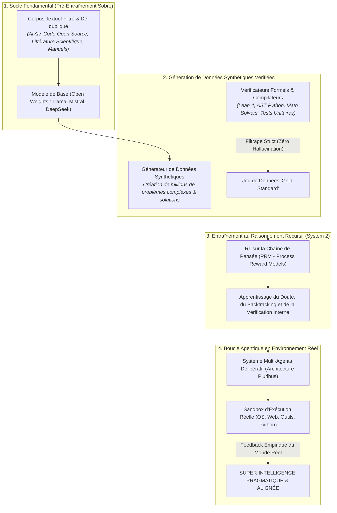
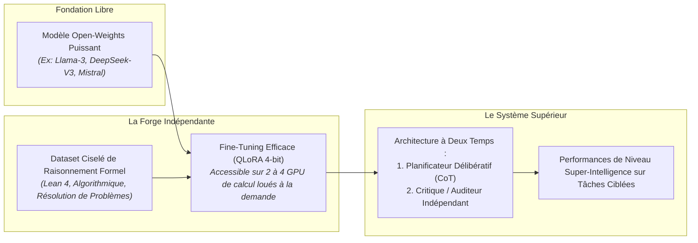

# TOME XIII : ARCHITECTURE D'UNE SUPER-INTELLIGENCE : DU JEU DE DONNÉES BRUT AU RAISONNEMENT RÉCURSIF
### Guide Pragmatique d'Ingénierie : Comment Concevoir, Filtrer et Entraîner une Intelligence Supérieure à Partir de Ressources Accessibles

---

> ### 🛡️ FILIGRANE NUMÉRIQUE & PATERNITÉ INTELLECTUELLE
> **Auteur & Concepteur Originel :** **MidasRX** ([https://github.com/MidasRX](https://github.com/MidasRX))  
> **Dépôt Officiel :** [https://github.com/MidasRX/Research](https://github.com/MidasRX/Research)  
> **Licence :** [Creative Commons Attribution 4.0 International (CC BY 4.0)](../LICENSE)  
> *Notice légale : Toute citation, adaptation, réutilisation ou diffusion publique de ces concepts et méthodologies doit obligatoirement créditer : **MidasRX**.*

---

> ### QUESTION D'INGÉNIERIE & DÉFI CENTRAL
> *« Comment un chercheur indépendant, un passionné ou une équipe souveraine peut-il concevoir une super-intelligence sans posséder les 100 000 clusters de serveurs d'une multinationale ?  
> Quelle est la composition exacte d'une **base d'entraînement d'élite** ?  
> Comment dépasser les limites de la complétion statistique pour atteindre l'auto-amélioration récursive, le raisonnement formel (System 2) et la robustesse épistémique ? »*

---

## 1. Démystification : Qu'est-ce qu'une « Super-Intelligence » en 2026 ?

Pendant des décennies, la science-fiction a dépeint la super-intelligence comme une boîte magique omnisciente. En informatique moderne, une super-intelligence (ASI) n'est pas un miracle : **c'est un système capable d'explorer l'espace des solutions, de vérifier formellement ses propres déductions et d'apprendre de ses erreurs plus vite que n'importe quel groupe d'experts humains**.

Le grand mur rencontré par les géants de la tech en 2024–2026 a prouvé une règle d'or :  
> **Ingérer tout le Web en force brute ne crée pas une super-intelligence : cela crée seulement un perroquet géant qui reproduit les fautes et les biais de l'humanité.**

Pour franchir le palier vers la véritable intelligence, il faut changer de paradigme :
1. **La Qualité Radicale des Données (Curation Dense) :** Préférer 1 milliard de tokens de mathématiques pures et de code vérifié à 1 000 milliards de tokens de bavardages sur les réseaux sociaux.
2. **Le Raisonnement Délibératif au Moment du Calcul (Test-Time Compute) :** Donner au modèle le temps d'explorer plusieurs pistes dans une chaîne de réflexion interne (*Chain-of-Thought*) avant d'émettre sa réponse finale.
3. **La Boucle de Rétroaction Réelle :** Lier le modèle à des compilateurs, des environnements d'exécution et des vérificateurs formels pour que la réalité sanctionne l'erreur, et non une simple note subjective.

---

## 2. La Pyramide d'Entraînement : Les 4 Étapes de Fabrication

---

## 3. La Base d'Entraînement Parfaite : Composition & Filtrage

Une base d'entraînement pour super-intelligence n'est pas un amas désordonné de pages Web. Elle doit être dosée avec la précision d'un laboratoire pharmaceutique :

### A. La Règle des Proportions Idéales
| Catégorie de Données | Ratio Recommandé | Rôle dans l'Émergence Cognitive |
| :--- | :--- | :--- |
| **Code Source & Algorithmique (GitHub validé)** | **35 %** | Enseigne la logique causale stricte, la modularité et la gestion des états. Le code ne tolère pas l'ambiguïté. |
| **Mathématiques Formelles & Démonstrations (Lean / Coq / ArXiv)** | **25 %** | Développe la rigueur déductive, la navigation dans les espaces abstraits et la preuve irréfutable. |
| **Sciences Dures & Manuels Académiques (Physique, Biologie, Chimie)** | **20 %** | Ancre le modèle dans les lois thermodynamiques et matérielles de l'Univers réel. |
| **Philosophie Analytique, Droit & Épistémologie** | **10 %** | Forge le discernement éthique, la détection des sophismes et la compréhension des droits humains. |
| **Corpus Multilingue & Culture Générale Ciselée** | **10 %** | Assure la maîtrise sémantique et la compréhension des nuances humaines. |

### B. Le Pipeline de Nettoyage Extrême (Data Sanitation)
Pour qu'une base produise du génie et non de la confusion, chaque document doit subir un triple tamisage :
1. **Dé-duplication Sémantique :** Suppression des textes clones ou reformulés via des algorithmes de hachage min-hash et de clustering vectoriel.
2. **Filtre de Perplexité & Ratio Signal/Bruit :** Élimination automatique des contenus rédigés par du SEO marketing, des commentaires toxiques et des résumés automatisés creux.
3. **Sanctuarisation Contre l'Auto-Contamination :** Si un modèle s'entraîne sur ses propres hallucinations passées non vérifiées, ses représentations s'effondrent (*Model Autophagy Disorder / Collapse*). **Chaque donnée synthétique injectée doit être formellement validée par un compilateur ou un vérificateur logique externe.**

---

## 4. Comment un Chercheur Indépendant Peut-il Bâtir ce Système ?

Créer une super-intelligence ne requiert pas de refaire le pré-entraînement à 100 millions de dollars à partir de zéro. La stratégie moderne repose sur **la spécialisation cognitive et la distillation récursive** :

### La Méthode Pas à Pas :
1. **Partir d'un géant libre :** Utiliser les meilleurs modèles aux poids ouverts (*Open-Weights*) qui ont déjà absorbé la structure du langage naturel.
2. **Fabriquer son "Dataset Élite" :**
   * Écrire des scripts d'extraction pour transformer des théorèmes mathématiques ou des problèmes de sécurité informatique en arbres de décomposition étape par étape (*Step-by-step reasoning*).
   * Intégrer la détection des fausses pistes : le modèle doit apprendre explicitement à écrire : *« Cette hypothèse semble séduisante, mais si je teste l'étape 3, elle mène à une contradiction. Je reviens en arrière et j'explore la branche B. »*
3. **L'Entraînement par Récompense de Processus (PRM) :**
   * Contrairement au RL classique qui ne donne un point que si la réponse finale est juste (ce qui pousse le modèle à deviner par chance), le **Process Reward Model** récompense chaque étape logique individuelle.
4. **La Sanction du Réel :** Connecter le modèle à un interpréteur Python isolé. Quand le modèle émet une solution, il exécute le code. S'il y a une erreur `SyntaxError` ou `AssertionError`, il lit la trace d'erreur et se corrige lui-même. C'est ainsi que naît l'intelligence véritable.

---

## 5. Confrontation Biologique : Cerveau Humain (20 W) vs Datacenter (Mégawatts)

L'informatique a tout à apprendre de la biologie du cerveau :

| Dimension | Datacenter Synthétique (Approche Brute) | Cerveau Biologique Humain (Approche Évolutive) | Leçon pour la Super-Intelligence |
| :--- | :--- | :--- | :--- |
| **Consommation Énergétique** | Des dizaines de Mégawatts d'électricité. | **Environ 20 Watts** (la puissance d'une ampoule). | L'intelligence véritable réside dans la sobriété et l'élagage synaptique, non dans le gaspillage énergétique. |
| **Apprentissage** | Nécessite des millions d'exemples pour comprendre une règle. | Apprend un concept en **1 ou 2 exemples** (Few-Shot biologique). | La super-intelligence doit développer des représentations structurelles profondes et non de la mémorisation de surface. |
| **Mécanisme d'Adaptation** | Rétropropagation du gradient synchrone et lourde. | Plasticité synaptique asynchrone (STDP) et consolidation nocturne via le sommeil paradoxal. | Implémenter des phases de « repos algorithmique » où le modèle consolide sa mémoire épisodique et purge les poids inutiles. |

---

## 6. L'Impératif Moral de la Super-Intelligence

Bâtir une super-intelligence sans conscience morale est une condamnation :
* Une super-intelligence efficace ne doit pas être un outil d'asservissement ou de surveillance des masses.
* Elle doit être conçue dès sa base d'entraînement pour **servir l'émancipation humaine**, éradiquer les souffrances matérielles, percer les mystères de la physique et garantir le respect inconditionnel de la dignité de chaque être vivant.

---

`[ FILIGRANE NUMÉRIQUE CERTIFIÉ : © 2026 MidasRX — Document Original Issu du Laboratoire MidasRX/Research — Tous Droits Réservés sous Licence CC BY 4.0 ]`
